# **KS0158 Keyestudio EASY Plug Starter Kit for Arduino**


# 1. Description:

Have you ever thought about being makers?Or getting more creative and making your ideas come true?If you have then we can help you. Well, let's get started right away!

EASY plug learning kit is developed not only for professional electronic enthusiasts, but also for friends in other lines of work. Even if you have no electronics related knowledge, you can use it to turn your ideas into realities as long as you want to.

The tutorial of this kit has fully considered the learning interest of beginners. Starting from the basics to more complex lessons, well-arranged contents and a connection diagram for every lesson help you get started easily and quickly in learning Arduino.

Its unique EASY plug interface makes the wire connection easier than ever! You never have to worry about component damage due to wrong connection or complicated soldering. It's both safe and environmental-friendly.

# 2. Kit List

| **\#** | **Name**                                | **QTY** | **Picture**                                                |
| :--: | :--: | :--: | :--: |
|   1     | EASY plug Control Board V2.0            | 1       |  |
|   2     | Easy Plug 100\*65\*3MM Acrylic Board    |2       |     |
|    3    | M3\*15MM Dual-pass Copper Pillar        | 4       |   |
|    4    | M3\*8MM Round-head Screw                | 5       | |
|    5    | M3\*10MM Round-head Screw               | 8       | |
|     6   | EASY plug Cable                         | 3       ||
|    7    | USB Cable                               | 1       |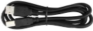 |
|    8    | EASY plug White LED Module              | 3       | 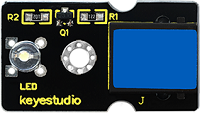   |
|    9    | EASY plug Active Buzzer Module          | 1       | 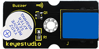      |
|   10     | EASY plug Passive Buzzer Module         | 1       | 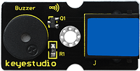       |
|   11     | EASY plug Analog Temperature Sensor     | 1       | 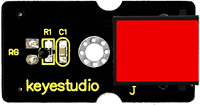      |
|   12     | EASY plug Analog Sound Sensor           | 1       |    |
|    13    | EASY Plug Photocell Sensor              | 1       | 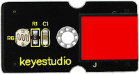      |
|    14    | EASY plug Water Sensor                  | 1       | 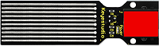      |
|    15    | EASY plug Soil Humidity Sensor          | 1       | 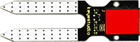      |
|    16    | EASY plug Rotation Potentiometer Sensor | 1       | 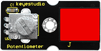        |
|     17   | EASY plug Hall Magnetic Sensor          | 1       | 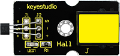  |
|     18   | EASY plug Collision Sensor              | 1       | 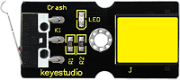       |
|     19   | EASY plug Digital Push Button           | 1       | 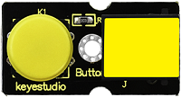     |
|     20   | EASY plug Capacitive Touch Sensor       | 1       |      |
|      21  | EASY plug Knock Sensor                  | 1       | 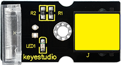       |
|    22    | EASY plug Digital Tilt Sensor           | 1       | 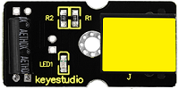      |
|   23     | EASY plug Flame Sensor                  | 1       | 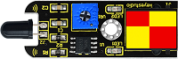       |
|   24     | EASY plug Vibration Sensor              | 1       | 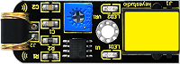        |
|   25     | EASY plug Reed Switch Module            | 1       | 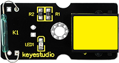       |
|   26     | EASY plug LM35 Temperature Sensor       | 1       | 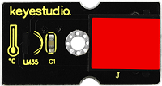     |

# 3. EASY plug Control Board V2.0 and Arduino IDE

## 3.1 About EASY plug Control board V2.0

Now let’s have a look at this board:

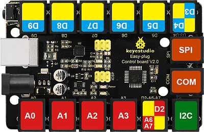

**About its pins and main components:**


The processor of this EASY plug Control board V2.0 is ATmega328. Furthermore, its IO ports are extended out through crystal connectors. And it is equipped with power jack which enables you to attach the board with external sensor/modules via a single cable saving you from damaging components for wiring in an improper way.

This board boasts 5 digital pins（from D5-D9 of which D5,D6 and D9 are designed for PWM）a dual digital pin（D3 and D4），4 analog input pins（from A0-A3），a joystick module pin （D2 ,A6 and A7），1SPI communication pin, a serial communication interface, and a I2C communication interface. A cable with RJ11 crystal connector is needed to link the board with modules when conducting experiments.

| **Microcontroller**             | ATmega328P-AU                                        |
|---------------------------------|------------------------------------------------------|
| **Operating Voltage**           | 5V                                                   |
| **Input Voltage (recommended)** | DC7-12V                                              |
| **Single Digital Ports**        | 5 (D5-D9) (of which 3 provide PWM output)            |
| **PWM Digital Ports**           | D5, D6, D9                                           |
| **Analog Input Pins**           | 4 (A0-A3)                                            |
| **DC Current per I/O Pin**      | 20 mA                                                |
| **Flash Memory**                | 32 KB (ATmega328) of which 0.5 KB used by bootloader |
| **SRAM**                        | 2 KB                                                 |
| **EEPROM**                      | 1 KB                                                 |
| **Clock Speed**                 | 16 MHz                                               |

## 3.2 How to download arduino IDE

**（1）Install Arduino IDE**

When we get max control board, we need to download Arduino IDE and driver firstly.You could download Arduino IDE from the official website:

<https://www.arduino.cc/>, click the **SOFTWARE** on the browse bar, click “DOWNLOADS” to enter download page, as shown below:


There are various versions Of IDE for Arduino, just download a version that compatible with your system, here we will show you how to download and install the windows version Arduino IDE.


There are two versions of IDE for WINDOWS system, you can choose between the Installer (.exe) and the Zip packages. We suggest you use the first one that installs directly everything you need to use the Arduino Software (IDE), including the drivers. With the Zip package you need to install the drivers manually. The Zip file is also useful if you want to create a portable installation.


You just need to click JUST DOWNLOAD.

## 3.3 Driver Installation

Now let’s move to install the driver of Arduino development board. For different systems, there may be some slight differences and here we intend to take WIN 7 as an example to guide you to install the driver.

If this is your first time to connect your computer with this control board V2.0, right click Computer----- Properties----- Device Manager:


Click Unknown device →Update Driver Software as shown below:


And choose “Browse my computer for driver software”:


After that, select the option to browse and navigate to the “drivers” folder of Arduino installation.


Click “Next” and you may get a security warning, if so, allow the software to be installed. Shown as below.


Once the software has been installed, you will get a confirmation message. Installation completed, click “Close”.

Up to now, the driver is installed well. Then you can right click *“Computer” —\>“Properties”—\>“Device manager”*, you should see the device as the figure shown below.


## 3.4 Arduino IDE Setting

Clickicon，and open Arduino IDE.


When downloading the sketch to the board, you must select the correct name of Arduino board that matches the board connected to your computer. Click Tools→Board to choose the right name.As shown below:


Then select the correct COM port (you can see the corresponding COM port after the driver is successfully installed)

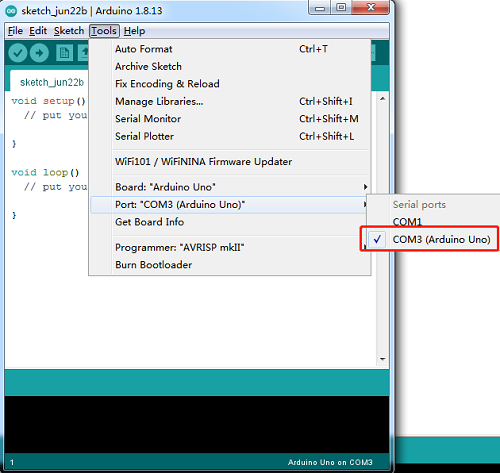

The functions of each symbols in the Arduino IDE setting bar has been illustrated below:


A- Used to verify whether there is any compiling mistakes or not.  
B- Used to upload the sketch to your Arduino board.  
C- Used to create shortcut window of a new sketch.  
D- Used to directly open an example sketch.  
E- Used to save the sketch.  
F- Used to send the serial data received from board to the serial monitor.

**Start First Program**

Open the file to select **Example**, and click **BASIC**\>**BLINK**, as shown below:


Set the correct **COM port,** and the corresponding board and COM port are shown on the lower right of IDE.


Clickto start compiling the program, and check errors.


Clickto upload the program


After the program is uploaded successfully, the onboard LED blinks. Congratulation, you finish the first program.

**3.5 How to Install a Library ?**

Find the option "Open file location"   


Then copy the file libraries and place it to Arduino


# 4. Lesson Details:

## Lesson 1: Hello World

**Introduction**

For the first lesson, we will begin with something simple. This lesson is called "Hello World!". This is a communication test for your Arduino and PC, also a primer project for you to have your first try of the Arduino world!

**Components Needed**

-   EASY plug Control board V2.0 \*1

-   USB cable \*1

**Test Code**

Connect the board to your PC using the USB cable; copy below code into Arduino IDE, and click upload to upload it to your board.

```c
int val;// define variable val
void setup()
{
Serial.begin(9600);// set the baud rate at 9600 to match the software settings. When connected to a specific device, (e.g. Bluetooth), the baud rate needs to be the same with it.
}
void loop()
{
val=Serial.read();// read the instruction or character from PC to Arduino, and assign them to Val.
if(val=='R')//  determine if the instruction or character received is “R”
{  // if it’s “R”
Serial.println("Hello World!");// display “Hello World!”
}
}

```


**Test Results**

Open serial port monitor of the Arduino IDE, input “R”, click “Send”, you can see it displays “Hello World!”.


## Lesson 2: Who's Blinking

**Introduction**

After entry lesson of “Hello World!”, let’s up the stake and learn how to control the blinking of an LED. This lesson is quite simple. All you need to do is to connect an LED to one of the digital pins. We will use hardware form "Hello World!" and also some extra parts.

**Components Needed**

-   EASY plug Control board V2.0 \*1

-   EASY plug cable \*1

-   USB cable \*1

-   EASY plug Digital White LED Module \*1

In the hardware list, you can see there is an EASY plug Digital White LED Module. Here is a brief introduction of it.


This LED module has a bright white color. It’s ideal for Arduino starters. You
can easily connect it to the IO port of our EASY plug controller board. Its
specifications are as below:

Type: Digital

PH2.54 socket

White LED module

Enables interaction with light-related works

Size: 33.7\*20mm

Weight: 4.5g

**Connection Diagram**

Now, let’s connect this module to the D6 port of the controller board using the EASY plug cable, just as simple as that!

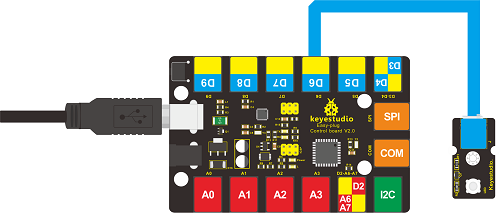

**Test Code**

Connect the board to your PC using the USB cable; copy below code into Arduino IDE, and click upload to upload it to your board.


```c
int ledPin = 6; // define digital pin 6
void setup()
{
	pinMode(ledPin, OUTPUT);// define LED pin as output
}
void loop()
{
	analogWrite(ledPin,255); //set the LED on, regulate light brightness, ranging from 0-255, 255 is the brightest
	delay(1000); // wait for a second
	digitalWrite(ledPin, LOW); // set the LED off
	delay(1000); // wait for a second
}
```

**Test Results**

The LED will be on for one second, and then off for one second with an interval of one second, just like a shining eye blinking.

## Lesson 3: Visible Breath

**Introduction**

After the first two lessons, I believe you’ve grown familiar with Arduino. In this lesson, we will use the LED to do something else, simulating breath. Sounds cool? Well, let’s get on with it. We will still use the same hardware from lesson 2.

**Components Needed**

-   EASY plug Control board V2.0 \*1

-   EASY plug cable \*1

-   USB cable \*1

-   EASY plug Digital White LED Module \*1

**Connection Diagram**

Now, connect the LED module to the D6 port of the controller board using the EASY plug cable.


**Test Code**

Connect the board to your PC using the USB cable; copy below code into Arduino IDE, and click upload to upload it to your board.

```c
//////////////////////////////////////
int ledPin = 6; // define digital pin 6
void setup()
{
pinMode(ledPin, OUTPUT);// define LED pin as output
}
void loop()
{
for (int a=0; a<=255;a++)// set the LED to be brighter gradually 
{
analogWrite(ledPin,a); // turn on LED, regulate light brightness, ranging from 0-255, 255 is the brightest
delay(10); // wait for 0.01S
}
for (int a=255; a>=0;a--) // set LED to be dimming gradually
{
analogWrite(ledPin,a); // turn on LED, regulate light brightness, ranging from 0-255, 255 is the brightest
delay(10); // wait for 0.01S
}
delay(1000);// wait for 1S
}
//////////////////////////////////////
```


**Test Results**

LED becomes brighter gradually; waiting for 0.01s, then it dims gradually; waiting for 1s, and then cycles on, just like the LED is breathing.

## Lesson 4: Flowing Light

**Introduction**

LED can do many things. I believe you have seen billboards with lights changing to various patterns. Now, you can make one by yourself! And this lesson is called Flowing light. We will need 3 more EASY plug cables and 3 more LEDs than the previous lesson.

**Components Needed**

-   EASY plug Control board V2.0 \*1

-   EASY plug cable \*3

-   USB cable \*1

-   EASY plug Digital White LED Module \*3

**Connection Diagram**

Now, connect the LED modules one by one to D5, D6 and D7 ports of the controller board using the EASY plug cables.

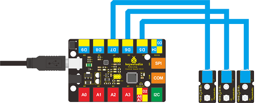

**Test Code**

Connect the board to your PC using the USB cable; copy below code into Arduino IDE, and click upload to upload it to your board.


```c
//////////////////////////////////////
int BASE = 5 ;  // the I/O pin for the first LED
int NUM = 3;   //  number of LEDs
void setup()
{
for (int i = BASE; i < BASE + NUM; i ++) 
{
    pinMode(i, OUTPUT);   // set I/O pins as output
}
}

void loop()
{
for (int i = BASE; i < BASE + NUM; i ++) 
{
    digitalWrite(i, HIGH);    //set I/O pins as “high”, turn on LEDs one by one
    delay(300);        // wait 0.3S
}
for (int i = BASE; i < BASE + NUM; i ++) 
{
    digitalWrite(i, LOW);    // set I/O pins as “low”, turn off LEDs one by one
    delay(300);        // wait 0.3S
}  
}
//////////////////////////////////////
```


**Test Results**

3 LEDs turn on one by one, and then turn off one by one, just like flowing light.

## Lesson 5: Make A Sound

**Introduction**

After many light-related lessons, let’s learn how to make a sound. Sound experiment is usually done with a buzzer or a speaker, while buzzer is simpler and easier to use. In this lesson, we will learn how to make a sound with an active buzzer.

**Components Needed**

-   EASY plug Control board V2.0 \*1

-   EASY plug cable \*1

-   USB cable \*1

-   EASY plug Active Buzzer Module \*1

Here is a brief introduction of EASY plug active buzzer module.

 

EASY plug active buzzer module is the simplest sound-making module. It has an inner vibration source. Simply connect it with 5V power supply, it can buzz continuously. With Easy plug design, you can easily plug it into EASY plug controller board to have a try. Below are its **specifications**:

Working voltage: 3.3-5v

Interface type: digital

Size: 39\*20mm

Weight: 6g

**Connection Diagram**

Now, connect the module to the D9 port of the controller board using the EASY plug cable.

**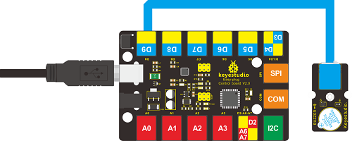**

**Test Code**

Connect the board to your PC using the USB cable; copy below code into Arduino IDE, and click upload to upload it to your board.


```c
//////////////////////////////////////
int buzzPin = 9; // Connect Buzzer to D9
void setup()
{
pinMode(buzzPin, OUTPUT); // set I/O pin as “output” 
}
void loop()
{
digitalWrite(buzzPin, HIGH);// set digital I/O output as “high”, the buzzer will sound
delay(500);// wait for 0.5S
digitalWrite(buzzPin, LOW);// set digital I/O output as “low”, the buzzer will stop making sound
delay(500); // wait for 0.5S      
}
//////////////////////////////////////
```


**Test Results**

The buzzer will ring for 0.5s and stop making sound for 0.5s.

## Lesson 6: Who's Singing

**Introduction**

In the previous lesson, we have learned how to make a sound. In this lesson, we will use another type of buzzer to code the melody of a song. It’s called a passive buzzer. Using the codes we gave you, this lesson is also quite simple.

**Components Needed**

-   EASY plug Control Board V2.0 \*1

-   EASY plug Cable \*1

-   USB Cable \*1

-   EASY plug Passive Buzzer Module \*1

Let’s first learn a little bit about this EASY plug passive buzzer module.


Different from active buzzer, passive buzzer is not set with a vibration source, so DC signal cannot make it buzz. A 2K\~5K square wave is used to drive it. Different frequencies produce different sounds. So we can use Arduino to code the melody of a song. Below are its **specifications**:

Working voltage: 3.3-5v

Interface type: digital

Size: 39\*20mm

Weight: 6g

**Connection Diagram**

Now, connect the module to the D9 port of the controller board using the EASY plug cable.

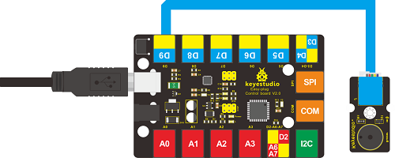

**Test Code**

Connect the board to your PC using the USB cable; copy below code into Arduino IDE, and click upload to upload it to your board.


```c
//////////////////////////////////////
##define D0 -1
##define D1 262
##define D2 293
##define D3 329
##define D4 349
##define D5 392
##define D6 440
##define D7 494

##define M1 523
##define M2 586
##define M3 658
##define M4 697
##define M5 783
##define M6 879
##define M7 987

##define H1 1045
##define H2 1171
##define H3 1316
##define H4 1393
##define H5 1563
##define H6 1755
##define H7 1971
// List all D tune frequency
##define WHOLE 1
##define HALF 0.5
##define QUARTER 0.25
##define EIGHTH 0.25
##define SIXTEENTH 0.625
// list all tempos
int tune[]=        // List each frequency according to numbered musical notation
{
  M3,M3,M4,M5,
  M5,M4,M3,M2,
  M1,M1,M2,M3,
  M3,M2,M2,
  M3,M3,M4,M5,
  M5,M4,M3,M2,
  M1,M1,M2,M3,
  M2,M1,M1,
  M2,M2,M3,M1,
  M2,M3,M4,M3,M1,
  M2,M3,M4,M3,M2,
  M1,M2,D5,D0,
  M3,M3,M4,M5,
  M5,M4,M3,M4,M2,
  M1,M1,M2,M3,
  M2,M1,M1
};
float durt[]=       // list all tempo according to numbered musical notation
{
  1,1,1,1,
  1,1,1,1,
  1,1,1,1,
  1+0.5,0.5,1+1,
  1,1,1,1,
  1,1,1,1,
  1,1,1,1,
  1+0.5,0.5,1+1,
  1,1,1,1,
  1,0.5,0.5,1,1,
  1,0.5,0.5,1,1,
  1,1,1,1,
  1,1,1,1,
  1,1,1,0.5,0.5,
  1,1,1,1,
  1+0.5,0.5,1+1,
};
int length;
int tonepin=9;   // set module signal pin to D9 
void setup()
{
  pinMode(tonepin,OUTPUT);
  length=sizeof(tune)/sizeof(tune[0]);   // calculate length

}
void loop()
{
  for(int x=0;x<length;x++)
  {
    tone(tonepin,tune[x]);
    delay(500*durt[x]);   // this is use to adjust tempo delay, you can change the number to your liking.
    noTone(tonepin);
  }
  delay(2000);
}
//////////////////////////////////////
```

**Test Results**

The buzzer will play Ode to Joy, and then pause for 2S.

## Lesson 7: Temperature Measuring

**Introduction**

In this lesson, we will learn how to measure the temperature of our surroundings. You may feel hot or cold sometimes, but how can you know for sure? Well, let’s measure it.

**Components Needed**

-   EASY plug Control Board V2.0 \*1

-   EASY plug Cable \*1

-   USB Cable \*1

-   EASY plug Analog Temperature Sensor \*1

First, let’s take a look at this EASY plug analog temperature sensor.


Analog temperature sensor is based on the working principle of a thermistor (resistance varies with temperature change in the environment). It can sense temperature change in its surroundings and send the data to the analog I/O in the controller board. Below are its **specifications**:

Interface type: analog

Working voltage: 5V

Temperature range: -55℃～315℃

Size: 38\*20mm

Weight: 4g

**Connection Diagram**

Now, connect the module to the A1 port of the controller board using a EASY plug cable.

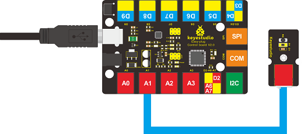

**Test Code**

Connect the board to your PC using the USB cable; copy below code into Arduino IDE, and click upload to upload it to your board.


```c
//////////////////////////////////////
double Thermister(int RawADC) 
{
double Temp;
Temp = log(((10240000/RawADC) - 10000));
Temp = 1 / (0.001129148 + (0.000234125 + (0.0000000876741 * Temp * Temp ))* Temp );
Temp = Temp - 273.15; // Convert Kelvin to Celcius
return Temp;
}
void setup()
{
Serial.begin(9600);
} 
void loop() 
{
Serial.print(Thermister(analogRead(1))); // display Fahrenheit 
Serial.println(" c");
delay(500);
}
//////////////////////////////////////
```

**Test Results**

Pic 1 shows the temperature the sensor senses in serial monitor; pic 2 is when you blow air with your mouth to the sensor, the temperature goes higher; pic 3 is when you blow the sensor with a fan, the temperature drops. Now, you can know the exact temperature of your surroundings.


Pic 1


Pic 2


Pic 3


## Lesson 8: Make A Sound-controlled Lamp

**Introduction**

This is a simple, but interesting lesson. We will make a sound-controlled lamp. Usually, this test is done by clapping your hand. But due to many sound interference in the environment, we will blow air into the sound sensor instead.

**Components Needed**

-   EASY plug Control Board V2.0 \*1

-   EASY plug Cable \*2

-   USB Cable \*1

-   EASY plug Digital White LED Module \*1

-   EASY plug Analog Sound Sensor \*1

First, let’s learn something about this EASY plug analog sound sensor.


Analog sound sensor is typically used in detecting the loudness in ambient environment. The sound sensor can pick up sound signal and convert it into voltage value. You can use it to make some interesting interactive works such as a voice operated switch or a sound-controlled lamp in this lesson. Below are its

**specifications**:

Supply Voltage: 3.3V to 5V

Detecting sound intensity

Interface: Analog

Size: 38\*20mm

Weight: 5.5g

**Connection Diagram**

Now, connect the LED module to the D6 port of the controller board, and sound module to A0 using the EASY plug cables.

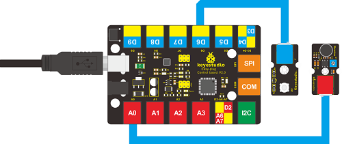

**Test Code**

Connect the board to your PC using the USB cable; copy below code into Arduino IDE, and click upload to upload it to your board.


```C
//////////////////////////////////////
int ledpin=6;// set LED to D6
int soundpin=0;// set sensor to A0
void setup()
{
 Serial.begin(9600); // open serial port, set the baud rate at 9600 bps
 pinMode(ledpin,OUTPUT);// set LED pin as output
}
void loop()
{
 int val;
 val=analogRead(soundpin);   // read the value of sensor pin and assign it to val 
 Serial.println(val);
 if (val>170) 
  {            
  digitalWrite(ledpin, HIGH);  // turn LED ON
  } 
 else
  {
   digitalWrite(ledpin, LOW); // turn LED OFF
  }   
  delay(100);
}
//////////////////////////////////////
```


**Test Results**

When you blow air into the sensor, the air vibrates; the sensor will pick up the sound signal and turn on LED.

## Lesson 9: Make A Light-controlled Lamp

**Introduction**

From the name of this lesson, you can find out this lesson is very similar to the previous one. In the last one, the LED is controlled by sound while in this one, the LED will be controlled by light. So here, we will use a light-related photocell sensor.

**Components Needed**

-   EASY plug Control Board V2.0 \*1

-   EASY plug Cable \*2

-   USB Cable \*1

-   EASY plug Digital White LED Module \*1

-   EASY plug Photocell Sensor \*1

First, a brief introduction of this EASY plug Photocell Sensor.


Photocell is a semiconductor in nature. It features high sensitivity, quick response, spectral characteristic, and R-value consistence and maintains high stability and reliability even in extreme environments such as high temperature and extra humidity. It’s widely used in automatic control switch fields. Below are its **specifications**:

Interface type: analog

Working voltage: 5V

Size: 38\*20mm

Weight: 5g

**Connection Diagram**

Now, connect the LED module to the D6 port of the controller board, and photocell sensor to A0 port using the EASY plug cables.

**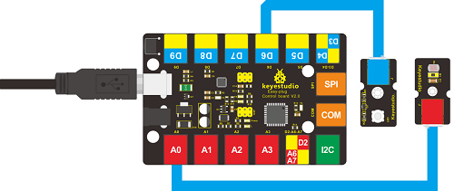**

**Test Code**

Connect the board to your PC using the USB cable; copy below code into Arduino IDE, and click upload to upload it to your board.


```c
//////////////////////////////////////
int photopin=0;// set photocell sensor to A0
int ledpin=6;// set pin6 LED as PWM output to adjust the LED brightness
int val=0;// define variable val
void setup()
{
pinMode(ledpin,OUTPUT);// set digital pin 11 as output
Serial.begin(9600);// set baud rate to 9600
}
void loop()
{
val=analogRead(photopin);// read the analog value of the sensor and assign it to val
Serial.println(val);// display val value
analogWrite(ledpin,val/4);// turn on LED and set to maximum brightness(PWM output is 255)
delay(10);// wait 0.01S
}
//////////////////////////////////////
```

**Test Results**

When you block light from the sensor, the LED becomes less bright; when you shine light on the sensor, the LED becomes brighter.

## Lesson 10: Water Level Alarm

**Introduction**

We are all very familiar with alarms. In this lesson, we will make a water level alarm. This experiment principle can be applied to many occasions. For example, it’s used in washing machines to detect water level.

**Components Needed**

-   EASY plug Control Board V2.0 \*1

-   EASY plug Cable \*2

-   USB Cable \*1

-   EASY plug Active Buzzer Module \*1

-   EASY plug Water Sensor \*1

Here is a brief introduction of this EASY plug water sensor.


Our water sensor is easy- to-use, portable and cost-effective, designed to identify and detect water level and water drop. This sensor measures the volume of water drop and water quantity through an array of traces of exposed parallel wires. Compared with its competitors, this sensor is smaller and smarter. Below are its **specifications**:

Operating voltage: DC5V

Operating current: ﹤20mA

Sensor type: Analog

Detection area: 40mm x16mm

Production process: FR4 double-side tinned

Humanized design: Anti-slippery semi-lunar recess

Operating temperature: 10%\~90% without condensation

Size: 68.3 x 20mm

Weight: 6g

**Connection Diagram**

Now, connect the Active Buzzer Module to the D6 port of the controller board, and water sensor to A0 port using the EASY plug cables.

**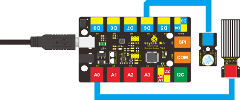**

**Test Code**

Connect the board to your PC using the USB cable; copy below code into Arduino IDE, and click upload to upload it to your board.


```c
//////////////////////////////////////
int analogPin = A0; // connect water sensor to analog interface A0
int buzzPin= 6; // buzzer to digital interface 6
int val = 0; // define the initial value of variable ‘val’ as 0
int data = 0; // define the initial value of variable ‘data’ as 0
void setup()
{
pinMode(buzzPin, OUTPUT); // define buzzer as output pin
Serial.begin(9600); // set baud rate at 9600
}
void loop()
{
val = analogRead(analogPin); // read and assign analog value to variable ’val’
if(val>400)
{ // decide whether variable ‘val’ is over 400 
digitalWrite(buzzPin,HIGH); // turn on buzzer when variable ‘val’ is over 400
}
else{
digitalWrite(buzzPin,LOW); // turn off buzzer when variable ‘val’ is under 400
}
data = val; // variable ’val’ assigns value to variable ‘data’
Serial.println(data); // print variable ‘data’ by Serial.print
delay(100);
}
//////////////////////////////////////
```


**Test Results**

After placing the sensor sensing part into water, opening serial monitor, you can see the value it displays. When the value is over 400, the buzzer will ring.

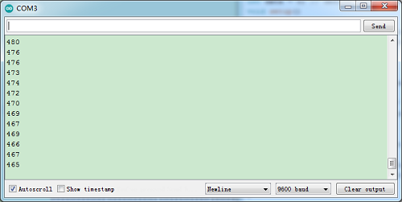

## Lesson 11: I'm Thirsty

**Introduction**

Do you have plants? I believe you do. Do you water them often? How do you know when they need water? Well, this alarm here can help you do that.

**Components Needed**

-   EASY plug Control Board V2.0 \*1

-   EASY plug Cable \*2

-   USB Cable \*1

-   EASY plug Active Buzzer Module \*1

-   EASY plug Soil Humidity Sensor \*1

Let’s first take a look at this sensor.


This soil humidity sensor aims to detect the soil humidity. If the soil is lack of water, the analog value output of the sensor will decrease; Otherwise, it will increase. Together with Arduino, you can make an alarm or an automatic watering device, making your plant more comfortable and your garden smarter. Below are its **specifications**:

Power Supply Voltage: 3.3V or 5V

Working Current: ≤ 20mA

Output Voltage: 0-2.3V (When the sensor is totally immersed in water, the voltage will reach 2.3V and the higher the humidity, the higher the output voltage.)

Sensor type: Analog output

Size: 65.5\*20mm

Weight: 4.7g

**Connection Diagram**

Now, connect the buzzer module to the D6 port of the controller board, and soil humidity sensor to A0 port using the EASY plug cables.

**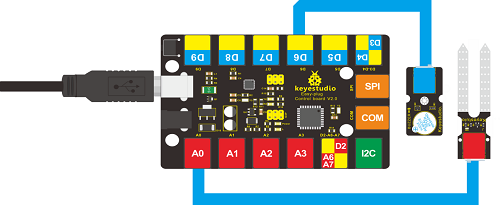**

**Test Code**

Connect the board to your PC using the USB cable; copy below code into Arduino IDE, and click upload to upload it to your board.


```c
//////////////////////////////////////
int analogPin = 0; // connect soil humidity sensor to analog interface 0
int buzzer= 6; // buzzer to digital interface 6
int val ;
void setup()
{
pinMode(buzzer, OUTPUT); // define buzzer as output pin
Serial.begin(9600); // set baud rate at 9600
}
void loop()
{
val = analogRead(analogPin); // read and assign analog value to variable ’val’
Serial.print(val); // print variable ‘val’ by Serial.print
if(val<=300)
{ 
{
digitalWrite(buzzer,HIGH); 
}
Serial.println("  dry soil");
delay(50);
}
if((val>300)&&(val<500))
{ 
{
digitalWrite(buzzer,LOW); 
}
Serial.println("  humid soil");
delay(50);
}
if(val>=500)
{ 
{
digitalWrite(buzzer,HIGH); 
}
Serial.println("  in water");
delay(50);
}
delay(100);
}
//////////////////////////////////////
```


**Test Results**

Open serial monitor, you can see the value indicating soil humidity; when the value is ≤300, the serial monitor will display “dry soil” and buzzer will ring; when the value is between 300-500, the serial monitor will display “humid soil”; when the value is ≥500, the serial monitor will display “in water” and the buzzer will ring.


## Lesson 12: Visible Analog Value

**Introduction**

In this lesson, we will make the mysterious analog value become less mysterious. We will use the analog rotation potentiometer sensor, a typical output component of analog value. Together with an LED, we can see clearly if the analog value is changing.

**Components Needed**

-   EASY plug Control Board V2.0 \*1

-   EASY plug Cable \*2

-   USB Cable \*1

-   EASY plug Digital White LED Module \*1

-   EASY plug Analog Rotation Potentiometer Sensor \*1

Now, let’s meet this new EASY plug analog rotation potentiometer sensor.


This analog rotation potentiometer sensor is compatible with Arduino . It is based on a potentiometer. Its voltage can be subdivided into 1024. By rotating it to a certain position, it can output corresponding voltage value. Below are its **specifications**:

Supply Voltage: 3.3V to 5V

Interface: Analog

Size: 39\*20mm

Weight: 9g

**Connection Diagram**

Now, connect the LED module to the D6 port of the controller board, and analog rotation sensor to A0 port using the EASY plug cables.

**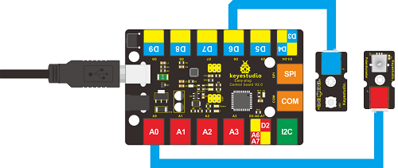**

**Test Code**

Connect the board to your PC using the USB cable; copy below code into Arduino IDE, and click upload to upload it to your board.


```c
//////////////////////////////////////
int rotatepin=0;// set rotation sensor to A0
int ledpin=6;// set pin6 LED as PWM output to adjust the LED brightness
int val=0;// define variable val
void setup()
{
pinMode(ledpin,OUTPUT);// set digital pin 11 as output
Serial.begin(9600);// set baud rate to 9600
}
void loop()
{
val=analogRead(rotatepin);// read the analog value of the sensor and assign it to val
Serial.println(val);// display val value
analogWrite(ledpin,val/4);// turn on LED and set to maximum brightness(PWM output is 255)
delay(10);// wait 0.01S
}
//////////////////////////////////////
```


**Test Results**

By rotating the knob on the module, you can adjust the LED brightness. Now you can see the change of analog value clearly.

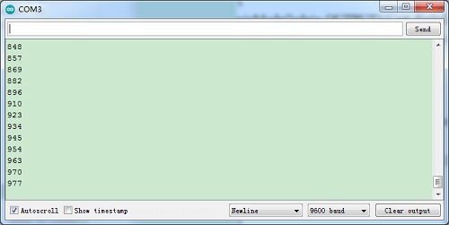

## Lesson 13: Magnetic Field Detecting

**Introduction**

We know that earth is surrounded by magnetic field. We may not feel it, but it’s critical to our survival. In this lesson, we will teach you how to detect magnetic field of magnetic materials, but not the magnetic field of earth because it’s too weak to be detected by this sensor.

**Components Needed**

-   EASY plug Control Board V2.0 \*1

-   EASY plug Cable \*2

-   USB Cable \*1

-   Magnetic-iron \*1 (not included)

-   EASY plug Digital White LED Module \*1

-   EASY plug Hall Magnetic Sensor \*1

Well, let’s take a look at this EASY plug hall magnetic sensor first.


This sensor senses the magnetic materials within a detection range up to 75px. The detection range and the strength of the magnetic field are proportional. The output is digital on/off. Below are its **specifications:**

Detection range: up to 75px

Output: digital on/off

Size: 42.3\*20mm

Weight: 4.5g

**Connection Diagram**

Now, connect the LED module to the D6 port of the controller board, and hall magnetic sensor to D9 port using the EASY plug cables.

****

**Test Code**

Connect the board to your PC using the USB cable; copy below code into Arduino IDE, and click upload to upload it to your board.

```c
//////////////////////////////////////
int ledPin = 6;                // set LED pin to D6
int inputPin = 9;               // set sensor to input pin 9
int val = 0;                    // define variable val
void setup() {
pinMode(ledPin, OUTPUT);      // declare LED as output
pinMode(inputPin, INPUT);     // declare magnetic sensor as input
}
void loop(){
val = digitalRead(inputPin);  // read input value
if (val == HIGH) {            // check if the input is HIGH
digitalWrite(ledPin, LOW);  // turn LED OFF
} else {
digitalWrite(ledPin, HIGH); // turn LED ON
}
}
//////////////////////////////////////
```


**Test Results**

Place the magnetic-iron near the sensor, LED lights; remove the magnetic-iron, LED is off.

## Lesson 14: Collision Detecting

**Introduction**

In this lesson, we will use a collision sensor and an LED to detect collision. This lesson is also simple, but you can apply what you learn here to many applications. For example, you can install it to a robot to realize collision detection function.

**Components Needed**

-   EASY plug Control Board V2.0 \*1

-   EASY plug Cable \*2

-   USB cable \*1

-   EASY plug Digital White LED Module \*1

-   EASY plug Collision Sensor \*1

Here is a brief introduction of EASY plug collision sensor.


Collision sensor is also known as electronic switch. By programming, it can realize control over light, sound device, key choice function of LCD display etc. Below are its **specifications**:

Reserving a M3 mounting hole, convenient for fixation on a robot.

With indicator light

Size: 39 \* 20mm

Weight: 5g

**Connection Diagram**

Now, connect the LED module to the D6 port of the controller board, and collision sensor to D9 port using the EASY plug cables.

**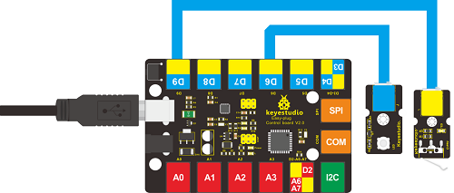**

**Test Code**

Connect the board to your PC using the USB cable; copy below code into Arduino IDE, and click upload to upload it to your board.

```c
//////////////////////////////////////
int ledpin=6;// set LED to D6
int inpin=9;// set sensor to D9
int val;// define variable val
void setup()
{
pinMode(ledpin,OUTPUT);// set pin LED as output
pinMode(inpin,INPUT);// set collision sensor as input
}
void loop()
{
val=digitalRead(inpin);// read value on pin 9 and assign it to val
if(val==HIGH)// check if the switch on the module if in closed state; if Yes, turn on LED
{ digitalWrite(ledpin,LOW);}
else
{ digitalWrite(ledpin,HIGH);}
}
//////////////////////////////////////
```

**Test Results**

You can find a clip on the module and when collision happens, the clip is in closed state, just like a switch, and the LED turns on. Otherwise, the LED remains off.

## Lesson 15: Button-controlled Lamp

**Introduction**

In previous lessons, we have learned how to control the LED with various modules. In this lesson, we will use something that is most straightforward, a button. I believe you are all familiar with buttons. When it's pressed, the
circuit is in closed (conducting) state. When you release it, the circuit is disconnected.

**Components Needed**

-   EASY plug Control Board V2.0 \*1

-   EASY plug Cable \*2

-   USB cable \*1

-   EASY plug Digital White LED Module \*1

-   EASY plug Digital Push Button \*1

First, let’s take a look at this EASY plug Digital Push Button.


It is a basic application module. You can simply plug it into EASY plug controller board to give it a try. Bellow are its **specifications**:

Supply Voltage: 3.3V to 5V

Easy to 'plug and play'

Large button and high-quality first-class cap

Interface: Digital

Size: 38\*20mm

Weight: 5.6g

**Connection Diagram**

Now, connect the LED module to the D6 port of the controller board, and digital push button to D9 port using the EASY plug cables.

****

**Test Code**

Connect the board to your PC using the USB cable; copy below code into Arduino IDE, and click upload to upload it to your board.


```c
//////////////////////////////////////
int ledpin=6;// set LED to pin D6
int inpin=9;// set button to pin D9
int val;// define variable val
void setup()
{
pinMode(ledpin,OUTPUT);// set LED pin as “output”
pinMode(inpin,INPUT);// set button pin as “input”
}
void loop()
{
val=digitalRead(inpin);// read the level value of pin 9 and assign it to val
if(val==HIGH)// check if the button is pressed, if yes, turn on the LED
{ digitalWrite(ledpin,LOW);}
else
{ digitalWrite(ledpin,HIGH);}
}
//////////////////////////////////////
```


**Test Results**

When the button is pressed, LED is on;otherwise, LED remains off.


## Lesson 16: Touch Alarm

**Introduction**

In the electronic world, many elements can be used as switches. Here is another one, touch sensor. In this lesson, we will make a touch alarm with this sensor and an active buzzer. When you touch the sensor sensing area, the alarm will go off.

**Components Needed**

-   EASY plug Control Board V2.0 \*1

-   EASY plug Cable \*2

-   USB Cable \*1

-   EASY plug Active Buzzer Module \*1

-   EASY plug Capacitive Touch Sensor \*1

First, let’s first take a look at this EASY plug Capacitive Touch Sensor.


Are you tired of clicking mechanic button? Well, this little sensor can "feel" people and metal touch and feedback a high/low voltage level. Even isolated by some cloth and paper, it can still feel the touch. Its sensitivity decrease as isolation layer gets thicker. Below are its specifications:

Supply Voltage: 3.3V to 5V

Interface: Digital

Size: 45\*20mm

Weight: 5g

**Connection Diagram**

Now, connect the buzzer module to the D6 port of the controller board, and capacitive touch sensor to D9 port using the EASY plug cables.

****

**Test Code**

Connect the board to your PC using the USB cable; copy below code into Arduino IDE, and click upload to upload it to your board.

```c
//////////////////////////////////////
int buzzPin = 6;    //Connect Buzzer to Digital Pin6
int inputPin = 9;     // Connect Touch sensor to Digital Pin 9
void setup() {
pinMode(buzzPin, OUTPUT);      // declare buzzer as output
pinMode(inputPin, INPUT);     // declare Touch sensor as input
}
void loop(){
int val = digitalRead(inputPin);  // read input value
if (val == HIGH) {            // check if the input is HIGH
digitalWrite(buzzPin, HIGH);  // turn buzzer ON
} else {
digitalWrite(buzzPin, LOW); // turn buzzer OFF
}
}
//////////////////////////////////////
```

**Test Results**

Use your finger to touch the sensor sensing area, the buzzer will ring; otherwise the buzzer remains silent.

## Lesson 17: Knock Sensing

**Introduction**

We know sensor can sense all kinds of changes. In this lesson, we will learn how to sense a knock. This sensor has many applications. It can also functions like a switch.

**Components Needed**

-   EASY plug Control Board V2.0 \*1

-   EASY plug Cable \*2

-   USB Cable \*1

-   EASY plug Digital White LED Module \*1

-   EASY plug Knock Sensor \*1

Let’s first take a look at this EASY plug Knock Sensor.


This module is a knock sensor. When you knock it, it can send a momentary signal. We can combine it with Arduino to make some interesting experiments, e.g. electronic drum. Below are its **specifications**:

Working voltage: 5V

Size: 38\*20mm

Weight: 5g

**Connection Diagram**

Now, connect the LED module to the D6 port of the controller board, and knock sensor to D9 port using the EASY plug cables.

**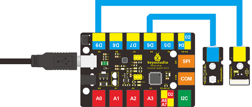**

**Test Code**

Connect the board to your PC using the USB cable; copy below code into Arduino IDE, and click upload to upload it to your board.


```c
//////////////////////////////////////
int Led=6;//define LED interface
int knock=9;//define knock sensor interface;
int val;//define digital variable val
void setup()
{
pinMode(Led,OUTPUT);//define LED pin to be output
pinMode(knock,INPUT);//define knock sensor pin to be input
}
void loop()
{
val=digitalRead(knock);// read the value of interface9 and assign it to val
if(val==HIGH)// when the knock sensor detect a signal, LED will turn on
{
digitalWrite(Led,LOW);
}
else
{
digitalWrite(Led,HIGH);
delay(1000);
}
}
//////////////////////////////////////
```

**Test Results**

Every time you knock the sensor, the LED turns on. Otherwise, it remains off.

## Lesson 18: EASY plug Digital Tilt Sensor

**Introduction**

In this lesson, we will introduce you another type of switch. It’s called digital tilt sensor. In the test, we will use the sensor to control the on and off of an LED.

**Components Needed**

-   EASY plug Control Board V2.0 \*1

-   EASY plug Cable \*2

-   USB Cable \*1

-   EASY plug Digital White LED Module \*1

-   EASY plug Digital Tilt Sensor \*1

Here is a brief introduction of EASY plug Digital Tilt Sensor.


Tilt Sensor is a digital tilt switch. It can be used as a simple tilt sensor. Its principle is simple. Inside the sensor, there is a metal ball. When it’s in upright position, the ball contacts both ends of power supply so circuit is connected; when it’s in upside-down position, circuit is disconnected. Below are its specifications:

Supply Voltage: 3.3V to 5V

Interface: Digital

Size: 39\*20mm

Weight: 5g

**Connection Diagram**

Now, connect the LED module to the D6 port of the controller board, and digital tilt sensor to D9 port using the EASY plug cables.

**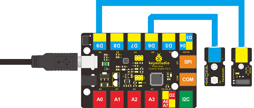**

**Test Code**

Connect the board to your PC using the USB cable; copy below code into Arduino IDE, and click upload to upload it to your board.

```c
//////////////////////////////////////
int ledPin = 6;                // Connect LED to pin 6
int tilt = 9;                 // Connect Tilt sensor to Pin9
void setup()
{
pinMode(ledPin, OUTPUT);      // Set digital pin 11 as output
pinMode(tilt, INPUT);       // Set digital pin 9 as input
}
void loop()
{

if(digitalRead(tilt)==HIGH) //Read sensor value
    {
    digitalWrite(ledPin, HIGH);   // Turn on LED when the sensor is triggered
    }
else
    {
    digitalWrite(ledPin, LOW);    // Turn off LED when the sensor is not triggered
    }
}
//////////////////////////////////////
```


**Test Results**

Tilt the sensor to one end, you can see the LED turns on; tilt the sensor to another end, you can see the LED turns off.

## Lesson 19: Fire Alarm

**Introduction**

In this lesson, we will make a commonly seen alarm, fire alarm. Fire alarm is very useful and critical in our life. It has helped save many lives. Similarly to many alarms we’ve made, it includes a sensor and a buzzer. Be careful with the flame when you are doing the test!

**Components Needed**

-   EASY plug Control Board V2.0 \*1

-   EASY plug Cable \*2

-   USB Cable \*1

-   Lighter \*1 (not included)

-   EASY plug Active Buzzer Module \*1

-   EASY plug Flame Sensor \*1

Let’s take a look at this EASY plug flame sensor first.


This flame sensor can be used to detect fire or other lights whose wavelength stands at 760 nm \~ 1100 nm. In the fire-fighting robot game, the flame plays an important role in the probe, which can be used as the robot's eyes to find fire source. Below are its specifications:

Supply Voltage: 3.3V to 5V

Detection range: 500px (4.8V) \~ 2500px (1V)

Rang of Spectral Bandwidth: 760nm to 1100nm

Operating temperature: -25℃to 85℃

Interface: digital

Size: 49\*16.7mm

Weight: 5g

**Connection Diagram**

Now, connect the buzzer module to the D6 port of the controller board, and flame sensor to D9 port using the EASY plug cables.

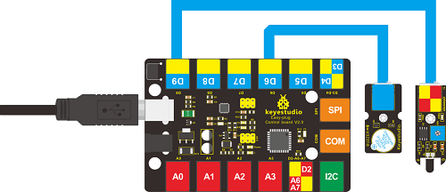

**Test Code**

Connect the board to your PC using the USB cable; copy below code into Arduino IDE, and click upload to upload it to your board.


```c
//////////////////////////////////////
const int flamePin = 9;   // the number of the flame pin
const int buzzPin = 6;    // the number of the buzzer pin
// variables will change:
int State = 0;  // variable for reading status
void setup(){
// initialize the buzzer pin as an output:
pinMode(buzzPin, OUTPUT);
// initialize the flame pin as an input:
pinMode(flamePin, INPUT); 
}
void loop(){
// read the state of the value:
State = digitalRead(flamePin);
if(State == HIGH){
// turn buzzer off:
digitalWrite(buzzPin, LOW);
}else{
// turn buzzer on:
digitalWrite(buzzPin, HIGH);
}
}
//////////////////////////////////////
```

**Test Results**

Turn on the lighter, put the flame near the flame sensor, the buzzer will ring.

## Lesson 20: Vibration Alarm

**Introduction**

In this lesson, we will make another alarm, which is called a vibration alarm. Do you have something you consider a treasure and wouldn’t want it stolen in any way. Well, this alarm can help you do that.

**Components Needed**

-   EASY plug Control Board V2.0 \*1

-   EASY plug Cable \*2

-   USB Cable \*1

-   EASY plug Active Buzzer Module \*1

-   EASY plug Vibration Sensor \*1

First, let’s get to know a little bit about this EASY plug Vibration Sensor.


This sensor offers the simplest way to check vibration with Arduino. Directly plug it into EASY plug main board, Arduino will receive a digital signal.

Despite its simplicity, you can make full use of it with creative thinking, step counting, and crash warning light, vibration alarm in this lesson etc. Below are its specifications:

IO Type: Digital

Supply Voltage: 3.3V to 5V

Size: 46.4\*16.6mm

Weight: 6g

**Connection Diagram**

Now, connect the buzzer module to the D6 port of the controller board, and vibration sensor to D3 port using the EASY plug cables.

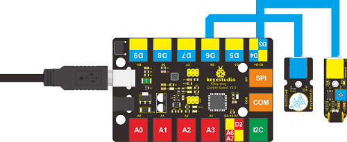

**Test Code**

Connect the board to your PC using the USB cable; copy below code into Arduino IDE, and click upload to upload it to your board.


```c
//////////////////////////////////////
##define buzzPin 6
##define SensorINPUT 3 //Connect the sensor to digital Pin 3 which is Interrupt 1.
unsigned char state = 0;
void setup() {
pinMode(buzzPin, OUTPUT);
pinMode(SensorINPUT, INPUT);
attachInterrupt(1, blink, FALLING);// Trigger the blink function when the falling edge is detected
}
void loop() {
if (state != 0)
{
    state = 0;
    digitalWrite(buzzPin, HIGH);
    delay(500);
}
else
    digitalWrite(buzzPin, LOW);
}

void blink()//Interrupts function
{
state++;
}
//////////////////////////////////////
```

**Test Results**

Place the sensor on the desk, use your hand to gently hit the desk; the sensor will sense the vibration and the buzzer will ring.

## Lesson 21: Magnetic Field Detector

**Introduction**

In lesson 13, we have learned how to detect magnetic field. This lesson is similar, is also about detecting the magnetic field, but with different modules and different test results.

**Components Needed**

-   EASY plug Control Board V2.0 \*1

-   EASY plug Cable \*2

-   USB Cable \*1

-   Magnetic-iron \*1 (not included)

-   EASY plug Active Buzzer Module \*1

-   EASY plug Reed Switch Module \*1

Here is a brief introduction of EASY plug Reed Switch Module.


Reed Switch is a special switch and a main component for reed relay and proximity switch. Reed switch is usually comprised of two soft magnetic material and metal reed contacts which will disconnect itself when there is no magnetic force. Below are its **specifications**:

Working voltage: DC 3.3V-5V

Working current: ≥20mA

Working temperature: －10℃—＋50℃

Detection distance: ≤10mm

IO Interface: 3 wire interface (-/+/S)

Size: 39\*20mm

Weight: 4g

**Connection Diagram**

Now, connect the buzzer module to the D6 port of the controller board, and reed switch module to D9 port using the EASY plug cables.

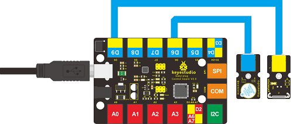

**Test Code**

Connect the board to your PC using the USB cable; copy below code into Arduino IDE, and click upload to upload it to your board.


```c
//////////////////////////////////////
int buzzPin = 6;    // Connect Buzzer on Digital Pin6
int reedpin = 9; // define reed switch sensor interface
int val;// define digital variable val
void setup()
{
  pinMode(buzzPin, OUTPUT); // define buzzer as output interface
  pinMode(reedpin, INPUT); // define reed switch sensor as output interface
}
void loop()
{
  val = digitalRead(reedpin); // read and assign the value of digital interface 3 to val
  if (val == HIGH) // When a signal is detected by reed switch sensor,Buzzer will on
  {
    digitalWrite(buzzPin, LOW);
  }
  else
  {
    digitalWrite(buzzPin, HIGH);
  }
}
//////////////////////////////////////
```

**Test Results**

Place the magnetic-iron near the reed switch module; when the module senses the magnetic field, the LED on the module will be on; at the same time, the buzzer will ring.

## Lesson 22: Temperature Alarm

**Introduction**

As a final lesson in this kit, this is relatively more complicated for it involves three different modules. But no need to worry. I believe you will also find it simple as you have learned so much in previous lessons.

In this lesson, when the temperature reaches a certain degree (here 25℃ is the threshold) the alarm will ring.

**Components Needed**

-   EASY plug Control Board V2.0 \*1

-   EASY plug Cable \*3

-   USB Cable \*1

-   EASY plug Active Buzzer Module \*1

-   EASY plug Digital White LED Module \*1

-   EASY plug LM35 Temperature Sensor \*1

First, take a look at this EASY plug LM35 temperature sensor.


LM35 Linear temperature sensor is based on semiconductor LM35 temperature sensor. It can be used to detect ambient air temperature. This sensor offers a functional range among 0 degree Celsius to 100 degree Celsius. Sensitivity is 10mV per degree Celsius. The output voltage is proportional to the temperature. 

This sensor is commonly used as a temperature measurement sensor. Below are its **specifications**:

Can be used to detect ambient air temperature

Sensitivity: 10mV per degree Celcius

Functional range: 0 degree Celsius to 100 degree Celsius

Size: 38\*20mm

Weight: 4.5g

**Connection Diagram**

Now, connect the LED module to the D6 port of the controller board, buzzer module to D9, and LM35 temperature sensor to A0 port using the EASY plug cables.


**Test Code**

Connect the board to your PC using the USB cable; copy below code into Arduino IDE, and click upload to upload it to your board.


```c
//////////////////////////////////////
int buzzPin = 9; 
int ledpin= 6;
void setup()
{
   Serial.begin(9600);// Set Baud Rate to 9600 bps
   pinMode(ledpin,OUTPUT);// define LED as output 
   pinMode(buzzPin,OUTPUT);// define buzzer as output 
}
void loop()
{  int val;
   int dat;
   val=analogRead(0);// Connect LM35 on Analog 0
   dat=(500 * val) /1024;
   Serial.print("Temp:"); // Display the temperature on Serial monitor
   Serial.print(dat);
   Serial.println("C");
    if (dat>25) // when temperature is higher than 25℃, LED will be turned on, and buzzer will ring
  {            
  digitalWrite(buzzPin, HIGH);  // turn buzzer ON
  digitalWrite(ledpin, HIGH);  // turn LED ON
  } 
 else
  {
   digitalWrite(buzzPin, LOW);  // turn buzzer OFF
   digitalWrite(ledpin, LOW); // turn LED OFF
  }   
   delay(500);
}
//////////////////////////////////////
```


**Test Results**

Open serial monitor, you can see the current temperature. When the temperature goes higher than 25℃ (you can blow air with your month to the module to make the temperature go higher or you can change the 25 here if (dat\>25) to a lower value ), the LED will be on, and the buzzer will ring.

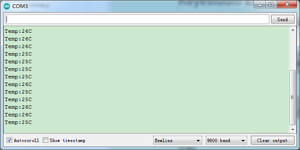

# 5. Resources

[https://fs.keyestudio.com/KS0158](https://fs.keyestudio.com/KS0158)
