# 1. Product introduction

**KS0158 Keyestudio EASY plug starter kit for Arduino**

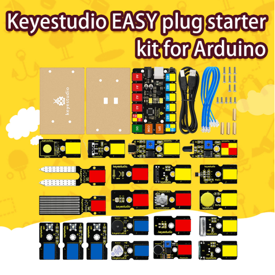

EASY plug starter kit for Arduino，based on open-source hardware,19 various sensors in one box,for you to make interesting projects.

## 1.1 Description

Have you ever thought about being makers?Or getting more creative and making your ideas come true?If you have then we can help you. Well, let's get started right away!

EASY plug learning kit is developed not only for professional electronic enthusiasts, but also for friends in other lines of work. Even if you have no electronics related knowledge, you can use it to turn your ideas into realities as long as you want to.

The tutorial of this kit has fully considered the learning interest of beginners. Starting from the basics to more complex lessons, well-arranged contents and a connection diagram for every lesson help you get started easily and quickly in learning Arduino.

Its unique EASY plug interface makes the wire connection easier than ever! You never have to worry about component damage due to wrong connection or complicated soldering. It's both safe and environmental-friendly.

## 1.2 Kit List

| No.  | Name                                                         | QTY  | Picture                                |
| ---- | ------------------------------------------------------------ | ---- | -------------------------------------- |
| 1    | EASY plug Control Board V2.0  (QTY:1) Easy Plug 100 * 65 * 3MM Acrylic Board(QTY:2) M3 * 15MM Dual-pass Copper Pillar(QTY:4) M3 * 8MM Round-head Screw(QTY:5) M3 * 10MM Round-head Screw(QTY:8) EASY plug Cable(QTY:3) USB Cable(QTY:1) |      | 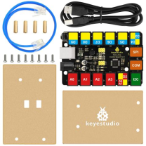 |
| 2    | EASY plug White LED Module                                   | 3    | 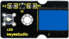 |
| 3    | EASY plug Active Buzzer Module                               | 1    | 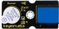 |
| 4    | EASY plug Passive Buzzer Module                              | 1    | 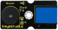 |
| 5    | EASY plug Analog Temperature Sensor                          | 1    | 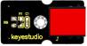 |
| 6    | EASY plug Analog Sound Sensor                                | 1    | 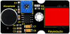 |
| 7    | EASY Plug Photocell Sensor                                   | 1    | 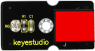 |
| 8    | EASY plug Water Sensor                                       | 1    | 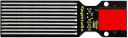 |
| 9    | EASY plug Soil Humidity Sensor                               | 1    | 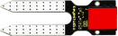 |
| 10   | EASY plug Rotation Potentiometer Sensor                      | 1    | 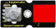 |
| 11   | EASY plug Hall Magnetic Sensor                               | 1    | 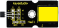 |
| 12   | EASY plug Collision Sensor                                   | 1    | 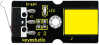 |
| 19   | EASY plug Digital Push Button                                | 1    | 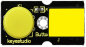 |
| 20   | EASY plug Capacitive Touch Sensor                            | 1    |  |
| 21   | EASY plug Knock Sensor                                       | 1    | 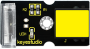 |
| 22   | EASY plug Digital Tilt Sensor                                | 1    | 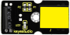 |
| 23   | EASY plug Flame Sensor                                       | 1    | 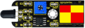 |
| 24   | EASY plug Vibration Sensor                                   | 1    | 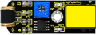 |
| 25   | EASY plug Reed Switch Module                                 | 1    |  |
| 26   | EASY plug LM35 Temperature Sensor                            | 1    | 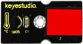 |

##  1.3 About EASY plug Control board V2.0

Now let’s  have a look at this board:

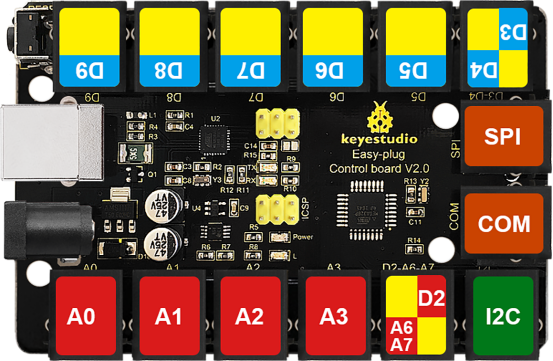

About its pins and main components:

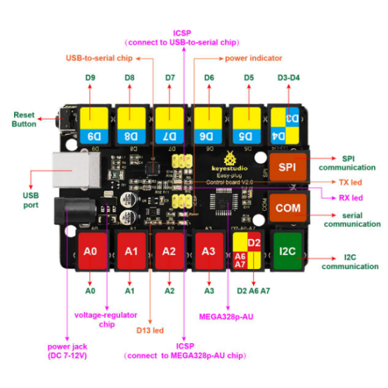

The processor of this EASY plug Control board V2.0 is ATmega328. Furthermore, its IO ports are extended out through crystal connectors. And it is equipped with power jack which enables you to attach the board with external sensor/modules via a single cable saving you from damaging components for wiring in an improper way.

This board boasts 5 digital pins（from D5-D9 of which D5,D6 and D9 are designed for PWM）a dual digital pin（D3 and D4），4 analog input pins（from A0-A3），a joystick module pin （D2 ,A6 and A7），1SPI communication pin, a serial communication interface,  and a I2C communication interface. A cable with RJ11 crystal connector is needed to link the board with modules when conducting experiments. 

| Microcontroller             | ATmega328P-AU                                        |
| --------------------------- | ---------------------------------------------------- |
| Operating Voltage           | 5V                                                   |
| Input Voltage (recommended) | DC7-12V                                              |
| Single Digital Ports        | 5 (D5-D9) (of which 3 provide PWM output)            |
| PWM Digital Ports           | D5, D6, D9                                           |
| Analog Input Pins           | 4 (A0-A3)                                            |
| DC Current per I/O Pin      | 20 mA                                                |
| Flash Memory                | 32 KB (ATmega328) of which 0.5 KB used by bootloader |
| SRAM                        | 2 KB                                                 |
| EEPROM                      | 1 KB                                                 |
| Clock Speed                 | 16 MHz                                               |