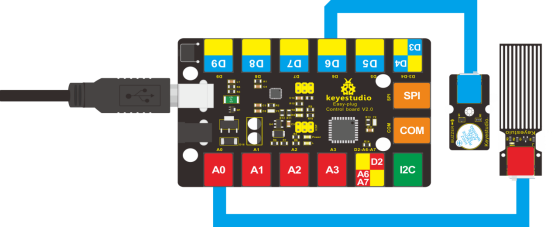
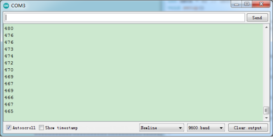

### Project 10 Water Level Alarm

**1.Introduction**

We are all very familiar with alarms. In this lesson, we will make a water level alarm. This experiment principle can be applied to many occasions. For example, it’s used in washing machines to detect water level.

**2.Components Needed**

- EASY plug Control Board V2.0 *1
- EASY plug Cable *2
- USB Cable *1
- EASY plug Active Buzzer Module *1
- EASY plug Water Sensor *1

Here is a brief introduction of this EASY plug water sensor.


Our water sensor is easy- to-use, portable and cost-effective, designed to identify and detect water level and water drop. This sensor measures the volume of water drop and water quantity through an array of traces of exposed parallel wires. Compared with its competitors, this sensor is smaller and smarter. Below are its specifications: 

- Operating voltage: DC5V
- Operating current: ﹤20mA
- Sensor type: Analog
- Detection area: 40mm x16mm
- Production process: FR4 double-side tinned
- Humanized design: Anti-slippery semi-lunar recess
- Operating temperature: 10%~90% without condensation
- Size: 68.3 x 20mm
- Weight: 6g

**3.Connection Diagram**

Now, connect the Active Buzzer Module to the D6 port of the controller board, and water sensor to A0 port using the EASY plug cables.



**4.Test Code**

Connect the board to your PC using the USB cable; copy below code into Arduino IDE, and click upload to upload it to your board.

```c
int analogPin = A0; // connect water sensor to analog interface A0
int buzzPin= 6; // buzzer to digital interface 6
int val = 0; // define the initial value of variable ‘val’ as 0
int data = 0; // define the initial value of variable ‘data’ as 0

void setup()
{
  	pinMode(buzzPin, OUTPUT); // define buzzer as output pin
  	Serial.begin(9600); // set baud rate at 9600
}

void loop()
{
    val = analogRead(analogPin); // read and assign analog value to variable ’val’
    if(val>400)
    { // decide whether variable ‘val’ is over 400 
    	digitalWrite(buzzPin,HIGH); // turn on buzzer when variable ‘val’ is over 400
    }
    else
    {
    	digitalWrite(buzzPin,LOW); // turn off buzzer when variable ‘val’ is under 400
    }
    data = val; // variable ’val’ assigns value to variable ‘data’
    Serial.println(data); // print variable ‘data’ by Serial.print
    delay(100);
}
```

**5.Test Results**

After placing the sensor sensing part into water, opening serial monitor, you can see the value it displays. When the value is over 400, the buzzer will ring. 

