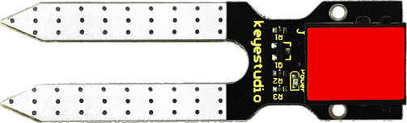
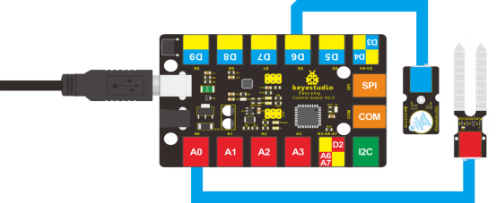
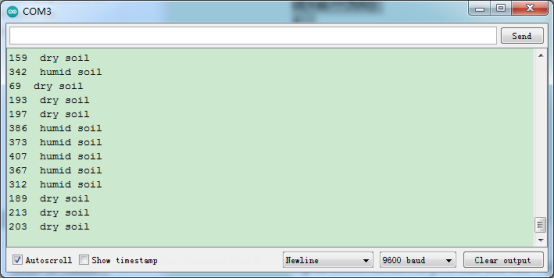

### Project 11 I'm Thirsty

**1.Introduction**

Do you have plants? I believe you do. Do you water them often? How do you know when they need water? Well, this alarm here can help you do that. 

**2.Components Needed**

- EASY plug Control Board V2.0 *1
- EASY plug Cable *2
- USB Cable *1
- EASY plug Active Buzzer Module *1
- EASY plug Soil Humidity Sensor *1

Let’s first take a look at this sensor.



This soil humidity sensor aims to detect the soil humidity. If the soil is lack of water, the analog value output of the sensor will decrease.

Otherwise, it will increase. Together with Arduino, you can make an alarm or an automatic watering device, making your plant more comfortable and your garden smarter. Below are its specifications:

- Power Supply Voltage: 3.3V or 5V
- Working Current: ≤ 20mA
- Output Voltage: 0-2.3V (When the sensor is totally immersed in water, the voltage will reach 2.3V and the higher the humidity, the higher the output voltage.)
- Sensor type: Analog output
- Size: 65.5*20mm
- Weight: 4.7g

**3.Connection Diagram**

Now, connect the buzzer module to the D6 port of the controller board, and soil humidity sensor to A0 port using the EASY plug cables.



**4.Test Code**

Connect the board to your PC using the USB cable; copy below code into Arduino IDE, and click upload to upload it to your board.

```c
int analogPin = 0; // connect soil humidity sensor to analog interface 0
int buzzer= 6; // buzzer to digital interface 6
int val ;

void setup()
{
    pinMode(buzzer, OUTPUT); // define buzzer as output pin
    Serial.begin(9600); // set baud rate at 9600
}

void loop()
{
    val = analogRead(analogPin); // read and assign analog value to variable ’val’
    Serial.print(val); // print variable ‘val’ by Serial.print
    if(val<=300)
    { 
        digitalWrite(buzzer,HIGH); 
        Serial.println("  dry soil");
        delay(50);
    }
    if((val>300)&&(val<500))
    { 
        digitalWrite(buzzer,LOW); 
        Serial.println("  humid soil");
        delay(50);
    }
    if(val>=500)
    {
        digitalWrite(buzzer,HIGH); 
        Serial.println("  in water");
        delay(50);
    }
    delay(100);
}
```

**5.Test Results**

Open serial monitor, you can see the value indicating soil humidity; when the value is ≤300, the serial monitor will display “dry soil” and buzzer will ring; when the value is between 300-500, the serial monitor will display “humid soil”; when the value is ≥500, the serial monitor will display “in water” and the buzzer will ring. 

