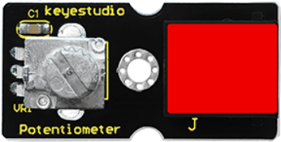
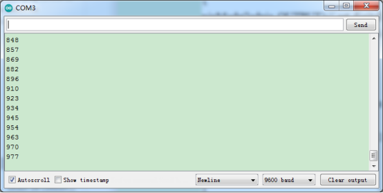

### Project 12 Visible Analog Value

**1.Introduction**

In this lesson, we will make the mysterious analog value become less mysterious. We will use the analog rotation potentiometer sensor, a typical output component of analog value. Together with an LED, we can see clearly if the analog value is changing.  

**2.Components Needed**

- EASY plug Control Board V2.0 *1
- EASY plug Cable *2
- USB Cable *1
- EASY plug Digital White LED Module *1
- EASY plug Analog Rotation Potentiometer Sensor *1

Now, let’s meet this new EASY plug analog rotation potentiometer sensor.



This analog rotation potentiometer sensor is compatible with Arduino . It is based on a potentiometer. Its voltage can be subdivided into 1024. By rotating it to a certain position, it can output corresponding voltage value. Below are its specifications:

- Supply Voltage: 3.3V to 5V
- Interface: Analog
- Size: 39*20mm
- Weight: 9g

**3.Connection Diagram**

Now, connect the LED module to the D6 port of the controller board, and analog rotation sensor to A0 port using the EASY plug cables.


**4.Test Code**

Connect the board to your PC using the USB cable; copy below code into Arduino IDE, and click upload to upload it to your board.

```c
int rotatepin=0;// set rotation sensor to A0
int ledpin=6;// set pin6 LED as PWM output to adjust the LED brightness
int val=0;// define variable val

void setup()
{
    pinMode(ledpin,OUTPUT);// set digital pin 11 as output
    Serial.begin(9600);// set baud rate to 9600
}

void loop()
{
    val=analogRead(rotatepin);// read the analog value of the sensor and assign it to val
    Serial.println(val);// display val value
    analogWrite(ledpin,val/4);// turn on LED and set to maximum brightness(PWM output is 255)
    delay(10);// wait 0.01S
}
```

**5.Test Results**

By rotating the knob on the module, you can adjust the LED brightness. Now you can see the change of analog value clearly.



