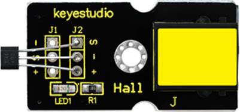

### Project 13 Magnetic Field Detecting

**1.Introduction**

We know that earth is surrounded by magnetic field. We may not feel it, but it’s critical to our survival. In this lesson, we will teach you how to detect magnetic field of magnetic materials, but not the magnetic field of earth because it’s too weak to be detected by this sensor. 

**2.Components Needed**

- EASY plug Control Board V2.0 *1
- EASY plug Cable *2
- USB Cable *1
- Magnetic-iron *1 (not included)
- EASY plug Digital White LED Module *1
- EASY plug Hall Magnetic Sensor *1

Well, let’s take a look at this EASY plug hall magnetic sensor first.



This sensor senses the magnetic materials within a detection range up to 75px. The detection range and the strength of the magnetic field are proportional. The output is digital on/off. Below are its specifications：

- Detection range: up to 75px
- Output: digital on/off
- Size: 42.3*20mm
- Weight: 4.5g

**3.Connection Diagram**

Now, connect the LED module to the D6 port of the controller board, and hall magnetic sensor to D9 port using the EASY plug cables.


**4.Test Code**

Connect the board to your PC using the USB cable; copy below code into Arduino IDE, and click upload to upload it to your board.

```c
int ledPin = 6;                // set LED pin to D6
int inputPin = 9;               // set sensor to input pin 9
int val = 0;                    // define variable val

void setup() 
{
  pinMode(ledPin, OUTPUT);      // declare LED as output
  pinMode(inputPin, INPUT);     // declare magnetic sensor as input
}

void loop()
{
  val = digitalRead(inputPin);  // read input value
  if (val == HIGH) 
  {            // check if the input is HIGH
    digitalWrite(ledPin, LOW);  // turn LED OFF
  } 
  else 
  {
    digitalWrite(ledPin, HIGH); // turn LED ON
  }
}
```

**5.Test Results**

Place the magnetic-iron near the sensor, LED lights; remove the magnetic-iron, LED is off.