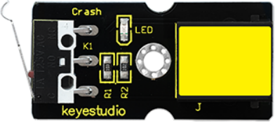

### Project 14 Collision Detecting

**1.Introduction**

In this lesson, we will use a collision sensor and an LED to detect collision. This lesson is also simple, but you can apply what you learn here to many applications. For example, you can install it to a robot to realize collision detection function. 

**2.Components Needed**

- EASY plug Control Board V2.0 *1
- EASY plug Cable *2
- USB cable *1
- EASY plug Digital White LED Module *1
- EASY plug Collision Sensor *1

Here is a brief introduction of EASY plug collision sensor.



Collision sensor is also known as electronic switch. By programming, it can realize control over light, sound device, key choice function of LCD display etc. Below are its specifications:

Reserving a M3 mounting hole, convenient for fixation on a robot.

- With indicator light
- Size: 39 * 20mm
- Weight: 5g

**3.Connection Diagram**

Now, connect the LED module to the D6 port of the controller board, and collision sensor to D9 port using the EASY plug cables.


**4.Test Code**

Connect the board to your PC using the USB cable; copy below code into Arduino IDE, and click upload to upload it to your board.

```c
int ledpin=6;// set LED to D6
int inpin=9;// set sensor to D9
int val;// define variable val

void setup()
{
    pinMode(ledpin,OUTPUT);// set pin LED as output
    pinMode(inpin,INPUT);// set collision sensor as input
}

void loop()
{
    val=digitalRead(inpin);// read value on pin 9 and assign it to val
    if(val==HIGH)// check if the switch on the module if in closed state; if Yes, turn on LED
    { 
        digitalWrite(ledpin,LOW);
    }
    else
    { 
    	digitalWrite(ledpin,HIGH);}
    }
}
```

**5.Test Results**

You can find a clip on the module and when collision happens, the clip is in closed state, just like a switch, and the LED turns on. Otherwise, the LED remains off. 