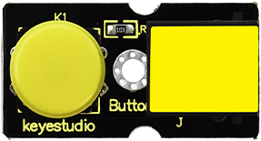
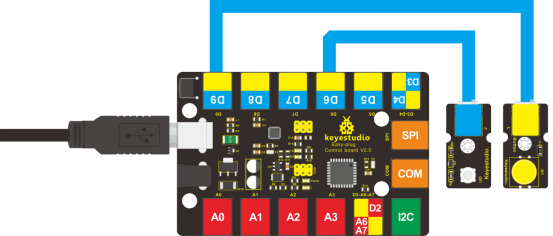

### Project 15 Button-controlled Lamp

**1.Introduction**

In previous lessons, we have learned how to control the LED with various modules. In this lesson, we will use something that is most straightforward, a button. I believe you are all familiar with buttons. When it's pressed, the circuit is in closed (conducting) state. When you release it, the circuit is disconnected. 

**2.Components Needed**

- EASY plug Control Board V2.0 *1
- EASY plug Cable *2
- USB cable *1
- EASY plug Digital White LED Modul
- EASY plug Digital Push Button *1

First, let’s take a look at this EASY plug Digital Push Button.



It is a basic application module. You can simply plug it into EASY plug controller board to give it a try. Bellow are its specifications: 

- Supply Voltage: 3.3V to 5V
- Easy to 'plug and play'
- Large button and high-quality first-class cap
- Interface: Digital
- Size: 38*20mm
- Weight: 5.6g

**3.Connection Diagram**

Now, connect the LED module to the D6 port of the controller board, and digital push button to D9 port using the EASY plug cables.



**4.Test Code**

Connect the board to your PC using the USB cable; copy below code into Arduino IDE, and click upload to upload it to your board.

```c
int ledpin=6;// set LED to pin D6
int inpin=9;// set button to pin D9
int val;// define variable val

void setup()
{
    pinMode(ledpin,OUTPUT);// set LED pin as “output”
    pinMode(inpin,INPUT);// set button pin as “input”
}

void loop()
{
    val=digitalRead(inpin);// read the level value of pin 9 and assign it to val
    if(val==HIGH)// check if the button is pressed, if yes, turn on the LED
    { 
    	digitalWrite(ledpin,LOW);
    }
    else
    { 
    	digitalWrite(ledpin,HIGH);
    }
}
```

**5.Test Results**

When the button is pressed, LED is on;otherwise, LED remains off. 