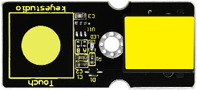
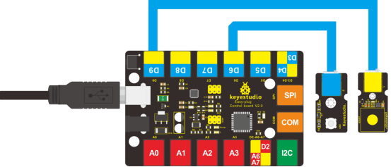

### Project 16 Touch Alarm

**1.Introduction**

In the electronic world, many elements can be used as switches. Here is another one, touch sensor. In this lesson, we will make a touch alarm with this sensor and an active buzzer. When you touch the sensor sensing area, the alarm will go off.  

**2.Components Needed**

- EASY plug Control Board V2.0 *1
- EASY plug Cable *2
- USB Cable *1
- EASY plug Active Buzzer Module *1
- EASY plug Capacitive Touch Sensor *1

First, let’s first take a look at this EASY plug Capacitive Touch Sensor.



Are you tired of clicking mechanic button? Well, this little sensor can "feel" people and metal touch and feedback a high/low voltage level. Even isolated by some cloth and paper, it can still feel the touch. Its sensitivity decrease as isolation layer gets thicker. Below are its specifications:

- Supply Voltage: 3.3V to 5V
- Interface: Digital
- Size: 45*20mm
- Weight: 5g

**3.Connection Diagram**

Now, connect the buzzer module to the D6 port of the controller board, and capacitive touch sensor to D9 port using the EASY plug cables.



**4.Test Code**

Connect the board to your PC using the USB cable; copy below code into Arduino IDE, and click upload to upload it to your board.

```c
int buzzPin = 6;    //Connect Buzzer to Digital Pin6
int inputPin = 9;     // Connect Touch sensor to Digital Pin 9

void setup() 
{
  pinMode(buzzPin, OUTPUT);      // declare buzzer as output
  pinMode(inputPin, INPUT);     // declare Touch sensor as input
}

void loop()
{
  int val = digitalRead(inputPin);  // read input value
  if (val == HIGH) 
  {            // check if the input is HIGH
    digitalWrite(buzzPin, HIGH);  // turn buzzer ON
  } 
  else 
  {
   digitalWrite(buzzPin, LOW); // turn buzzer OFF
  }
}
```

**5.Test Results**

Use your finger to touch the sensor sensing area, the buzzer will ring; otherwise the buzzer remains silent. 