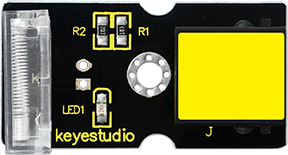
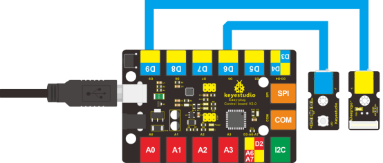

### Project 17 Knock Sensing

**1.Introduction**

We know sensor can sense all kinds of changes. In this lesson, we will learn how to sense a knock. This sensor has many applications. It can also functions like a switch.

**2.Components Needed**

EASY plug Control Board V2.0 *1

EASY plug Cable *2

USB Cable *1

EASY plug Digital White LED Module *1

EASY plug Knock Sensor *1

Let’s first take a look at this EASY plug Knock Sensor.



This module is a knock sensor. When you knock it, it can send a momentary signal. We can combine it with Arduino to make some interesting experiments, e.g. electronic drum. Below are its specifications:

- Working voltage: 5V
- Size: 38*20mm
- Weight: 5g

**3.Connection Diagram**

Now, connect the LED module to the D6 port of the controller board, and knock sensor to D9 port using the EASY plug cables.



**4.Test Code**

Connect the board to your PC using the USB cable; copy below code into Arduino IDE, and click upload to upload it to your board.

```c
int Led=6;//define LED interface
int knock=9;//define knock sensor interface;
int val;//define digital variable val

void setup()
{
    pinMode(Led,OUTPUT);//define LED pin to be output
    pinMode(knock,INPUT);//define knock sensor pin to be input
}

void loop()
{
    val=digitalRead(knock);// read the value of interface9 and assign it to val
    if(val==HIGH)// when the knock sensor detect a signal, LED will turn on
    {
    	digitalWrite(Led,LOW);
    }
    else
    {
        digitalWrite(Led,HIGH);
        delay(1000);
    }
}
```

**5.Test Results**

Every time you knock the sensor, the LED turns on. Otherwise, it remains off. 