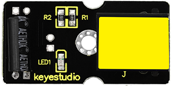
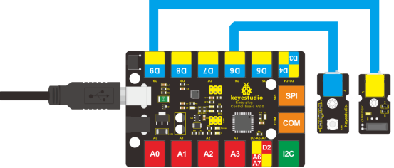

### Project 18 EASY plug Digital Tilt Sensor

**1. Introduction**

In this lesson, we will introduce you another type of switch. It’s called digital tilt sensor. In the test, we will use the sensor to control the on and off of an LED. 

**2.Components Needed**

- EASY plug Control Board V2.0 *1
- EASY plug Cable *2
- USB Cable *1
- EASY plug Digital White LED Module 
- EASY plug Digital Tilt Sensor *1

Here is a brief introduction of EASY plug Digital Tilt Sensor.



Tilt Sensor is a digital tilt switch. It can be used as a simple tilt sensor. Its principle is simple. Inside the sensor, there is a metal ball. When it’s in upright position, the ball contacts both ends of power supply so circuit is connected; when it’s in upside-down position, circuit is disconnected. Below are its specifications:

- Supply Voltage: 3.3V to 5V
- Interface: Digital
- Size: 39*20mm
- Weight: 5g

**3.Connection Diagram**

Now, connect the LED module to the D6 port of the controller board, and digital tilt sensor to D9 port using the EASY plug cables.



**4.Test Code**

Connect the board to your PC using the USB cable; copy below code into Arduino IDE, and click upload to upload it to your board.

```c
int ledPin = 6;                // Connect LED to pin 6
int tilt = 9;                 // Connect Tilt sensor to Pin9

void setup()
{
  pinMode(ledPin, OUTPUT);      // Set digital pin 11 as output
  pinMode(tilt, INPUT);       // Set digital pin 9 as input
}

void loop()
{
	if(digitalRead(tilt)==HIGH) //Read sensor value
    {
       digitalWrite(ledPin, HIGH);   // Turn on LED when the sensor is triggered
    }
  	else
    {
       digitalWrite(ledPin, LOW);    // Turn off LED when the sensor is not triggered
    }
}
```

**5.Test Results**

Tilt the sensor to one end, you can see the LED turns on; tilt the sensor to another end, you can see the LED turns off.