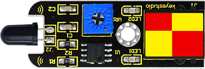
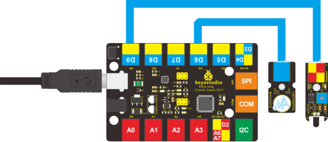

### Project 19 Fire Alarm

**1.Introduction**

In this lesson, we will make a commonly seen alarm, fire alarm. Fire alarm is very useful and critical in our life. It has helped save many lives. Similarly to many alarms we’ve made, it includes a sensor and a buzzer. Be careful with the flame when you are doing the test!

**2.Components Needed**

- EASY plug Control Board V2.0 *1
- EASY plug Cable *2
- USB Cable *1
- Lighter *1 (not included)
- EASY plug Active Buzzer Module
- EASY plug Flame Sensor *1

Let’s take a look at this EASY plug flame sensor first.



This flame sensor can be used to detect fire or other lights whose wavelength stands at 760 nm ~ 1100 nm. In the fire-fighting robot game, the flame plays an important role in the probe, which can be used as the robot's eyes to find fire source. Below are its specifications:

- Supply Voltage: 3.3V to 5V
- Detection range: 500px (4.8V) ~ 2500px (1V)
- Rang of Spectral Bandwidth: 760nm to 1100nm
- Operating temperature: -25℃to 85℃
- Interface: digital
- Size: 49*16.7mm
- Weight: 5g

**3.Connection Diagram**

Now, connect the buzzer module to the D6 port of the controller board, and flame sensor to D9 port using the EASY plug cables.



**4.Test Code**

Connect the board to your PC using the USB cable; copy below code into Arduino IDE, and click upload to upload it to your board.

```c
const int flamePin = 9;   // the number of the flame pin
const int buzzPin = 6;    // the number of the buzzer pin
// variables will change:
int State = 0;  // variable for reading status

void setup()
{
  // initialize the buzzer pin as an output:
  pinMode(buzzPin, OUTPUT);
  // initialize the flame pin as an input:
  pinMode(flamePin, INPUT); 
}

void loop()
{
  // read the state of the value:
  State = digitalRead(flamePin);
  if(State == HIGH)
  {
      // turn buzzer off:
      digitalWrite(buzzPin, LOW);
  }
  else
  {
      // turn buzzer on:
      digitalWrite(buzzPin, HIGH);
  }
}
```

**5.Test Results**

Turn on the lighter, put the flame near the flame sensor, the buzzer will ring.