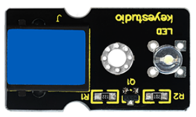
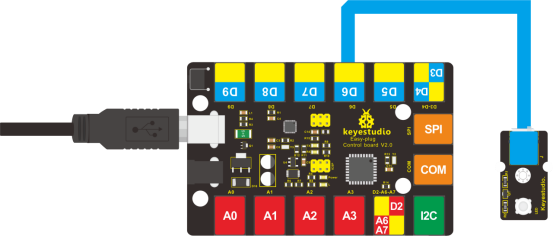

### Project 2 Who's Blinking

**1.Introduction**

After entry lesson of “Hello World!”, let’s up the stake and learn how to control the blinking of an LED. This lesson is quite simple. All you need to do is to connect an LED to one of the digital pins. We will use hardware form "Hello World!" and also some extra parts.

**2.Components Needed**

- EASY plug Control board V2.0 *1
- EASY plug cable *1
- USB cable *1
- EASY plug Digital White LED Module *1

In the hardware list, you can see there is an EASY plug Digital White LED Module. Here is a brief introduction of it.



This LED module has a bright white color. It’s ideal for Arduino starters. You can easily connect it to the IO port of our EASY plug controller board. Its specifications are as below:

- Type: Digital
- PH2.54 socket
- White LED module
- Enables interaction with light-related works
- Size: 33.7*20mm
- Weight: 4.5g

**3.Connection Diagram**

Now, let’s connect this module to the D6 port of the controller board using the EASY plug cable, just as simple as that!



**4.Test Code**

```c
int ledPin = 6; // define digital pin 6

void setup()
{
	pinMode(ledPin, OUTPUT);// define LED pin as output
}

void loop()
{
    analogWrite(ledPin,255); //set the LED on, regulate light brightness, ranging from 0-255, 255 is the brightest
    delay(1000); // wait for a second
    digitalWrite(ledPin, LOW); // set the LED off
    delay(1000); // wait for a second
}
```

**5.Test Results**

The LED will be on for one second, and then off for one second with an interval of one second, just like a shining eye blinking.