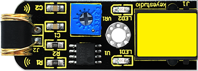
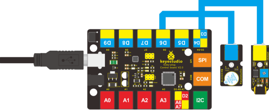

### Project 20 Vibration Alarm

**1.Introduction**

In this lesson, we will make another alarm, which is called a vibration alarm. Do you have something you consider a treasure and wouldn’t want it stolen in any way. Well, this alarm can help you do that.

**2.Components Needed**

- EASY plug Control Board V2.0 *1
- EASY plug Cable *2
- USB Cable *1
- EASY plug Active Buzzer Module
- EASY plug Vibration Sensor *1

First, let’s get to know a little bit about this EASY plug Vibration Sensor.



This sensor offers the simplest way to check vibration with Arduino. Directly plug it into EASY plug main board, Arduino will receive a digital signal.

Despite its simplicity, you can make full use of it with creative thinking, step counting, and crash warning light, vibration alarm in this lesson etc. Below are its specifications:

- IO Type: Digital
- Supply Voltage: 3.3V to 5V
- Size: 46.4*16.6mm
- Weight: 6g

**3.Connection Diagram**

Now, connect the buzzer module to the D6 port of the controller board, and vibration sensor to D3 port using the EASY plug cables.



**4.Test Code**

Connect the board to your PC using the USB cable; copy below code into Arduino IDE, and click upload to upload it to your board.

```c
#define buzzPin 6
#define SensorINPUT 3 //Connect the sensor to digital Pin 3 which is Interrupt 1.
unsigned char state = 0;

void setup() 
{
  pinMode(buzzPin, OUTPUT);
  pinMode(SensorINPUT, INPUT);
  attachInterrupt(1, blink, FALLING);// Trigger the blink function when the falling edge is detected
}

void loop() 
{
  if (state != 0)
  {
    state = 0;
    digitalWrite(buzzPin, HIGH);
    delay(500);
  }
  else
    digitalWrite(buzzPin, LOW);
}

void blink()//Interrupts function
{
  state++;
}
```

**Test Results**

Place the sensor on the desk, use your hand to gently hit the desk; the sensor will sense the vibration and the buzzer will ring.