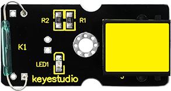
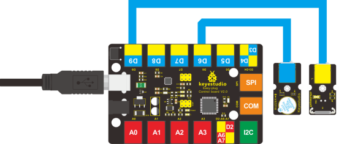

### Project 21 Magnetic Field Detector

**1.Introduction**

In lesson 13, we have learned how to detect magnetic field. This lesson is similar, is also about detecting the magnetic field, but with different modules and different test results. 

**2.Components Needed**

- EASY plug Control Board V2.0 *1
- EASY plug Cable *2
- USB Cable *1
- Magnetic-iron *1 (not included)
- EASY plug Active Buzzer Module *1
- EASY plug Reed Switch Module *1

Here is a brief introduction of EASY plug Reed Switch Module.



Reed Switch is a special switch and a main component for reed relay and proximity switch. Reed switch is usually comprised of two soft magnetic material and metal reed contacts which will disconnect itself when there is no magnetic force. Below are its specifications: 

- Working voltage: DC 3.3V-5V
- Working current: ≥20mA
- Working temperature: －10℃—＋50℃
- Detection distance: ≤10mm
- IO Interface: 3 wire interface (-/+/S)
- Size: 39*20mm
- Weight: 4g

**3.Connection Diagram**

Now, connect the buzzer module to the D6 port of the controller board, and reed switch module to D9 port using the EASY plug cables.



**4.Test Code**

Connect the board to your PC using the USB cable; copy below code into Arduino IDE, and click upload to upload it to your board.

```c
int buzzPin = 6;    // Connect Buzzer on Digital Pin6
int reedpin = 9; // define reed switch sensor interface
int val;// define digital variable val

void setup()
{
  pinMode(buzzPin, OUTPUT); // define buzzer as output interface
  pinMode(reedpin, INPUT); // define reed switch sensor as output interface
}
  
void loop()
{
  val = digitalRead(reedpin); // read and assign the value of digital interface 3 to val
  if (val == HIGH) // When a signal is detected by reed switch sensor,Buzzer will on
  {
    digitalWrite(buzzPin, LOW);
  }
  else
  {
    digitalWrite(buzzPin, HIGH);
  }
}
```

**5.Test Results**

Place the magnetic-iron near the reed switch module; when the module senses the magnetic field, the LED on the module will be on; at the same time, the buzzer will ring. 