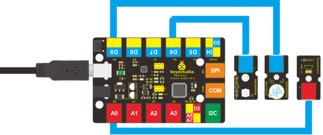

### Project 22 Temperature Alarm

**1.Introduction**

As a final lesson in this kit, this is relatively more complicated for it involves three different modules. But no need to worry. I believe you will also find it simple as you have learned so much in previous lessons. 

In this lesson, when the temperature reaches a certain degree (here 25℃ is the threshold) the alarm will ring. 

**2.Components Needed**

- EASY plug Control Board V2.0 *1
- EASY plug Cable *3
- USB Cable *1
- EASY plug Active Buzzer Module *1
- EASY plug Digital White LED Module *1
- EASY plug LM35 Temperature Sensor *1

First, take a look at this EASY plug LM35 temperature sensor.


LM35 Linear temperature sensor is based on semiconductor LM35 temperature sensor. It can be used to detect ambient air temperature. This sensor offers a functional range among 0 degree Celsius to 100 degree Celsius. Sensitivity is 10mV per degree Celsius. The output voltage is proportional to the temperature.

This sensor is commonly used as a temperature measurement sensor. Below are its specifications:

- Can be used to detect ambient air temperature
- Sensitivity: 10mV per degree Celcius
- Functional range: 0 degree Celsius to 100 degree Celsius
- Size: 38*20mm
- Weight: 4.5g

**3.Connection Diagram**

Now, connect the LED module to the D6 port of the controller board, buzzer module to D9, and LM35 temperature sensor to A0 port using the EASY plug cables.



**4.Test Code**

Connect the board to your PC using the USB cable; copy below code into Arduino IDE, and click upload to upload it to your board.

```c
int buzzPin = 9; 
int ledpin= 6;

void setup()
{
   Serial.begin(9600);// Set Baud Rate to 9600 bps
   pinMode(ledpin,OUTPUT);// define LED as output 
   pinMode(buzzPin,OUTPUT);// define buzzer as output 
}

void loop()
{  
   int val;
   int dat;
   val=analogRead(0);// Connect LM35 on Analog 0
   dat=(500 * val) /1024;
   Serial.print("Temp:"); // Display the temperature on Serial monitor
   Serial.print(dat);
   Serial.println("C");
   if (dat>25) // when temperature is higher than 25℃, LED will be turned on, and buzzer will ring
  {            
      digitalWrite(buzzPin, HIGH);  // turn buzzer ON
      digitalWrite(ledpin, HIGH);  // turn LED ON
  } 
  else
  {
      digitalWrite(buzzPin, LOW);  // turn buzzer OFF
      digitalWrite(ledpin, LOW); // turn LED OFF
  }   
  delay(500);
}
```

**5.Test Results**

Open serial monitor, you can see the current temperature. When the temperature goes higher than 25℃ (you can blow air with your month to the module to make the temperature go higher or you can change the 25 here if (dat>25) to a lower value ), the LED will be on, and the buzzer will ring. 

