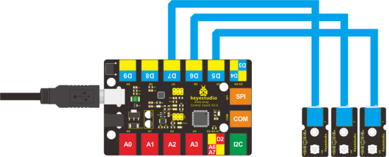

### Project 4 Flowing Light

**1.Introduction**

LED can do many things. I believe you have seen billboards with lights changing to various patterns. Now, you can make one by yourself! And this lesson is called Flowing light. We will need 3 more EASY plug cables and 3 more LEDs than the previous lesson.

**2.Components Needed**

- EASY plug Control board V2.0 *1
- EASY plug cable *3
- USB cable *1
- EASY plug Digital White LED Module *3

**3.Connection Diagram**

Now, connect the LED modules one by one to D5, D6 and D7 ports of the controller board using the EASY plug cables.



**4.Test Code**

Connect the board to your PC using the USB cable; copy below code into Arduino IDE, and click upload to upload it to your board.

```c
int BASE = 5 ;  // the I/O pin for the first LED
int NUM = 3;   //  number of LEDs

void setup()
{
   for (int i = BASE; i < BASE + NUM; i ++) 
   {
     pinMode(i, OUTPUT);   // set I/O pins as output
   }
}

void loop()
{
   for (int i = BASE; i < BASE + NUM; i ++) 
   {
     digitalWrite(i, HIGH);    //set I/O pins as “high”, turn on LEDs one by one
     delay(300);        // wait 0.3S
   }
    for (int i = BASE; i < BASE + NUM; i ++) 
   {
     digitalWrite(i, LOW);    // set I/O pins as “low”, turn off LEDs one by one
     delay(300);        // wait 0.3S
   }  
}
```

**5.Test Results**

3 LEDs turn on one by one, and then turn off one by one, just like flowing light.