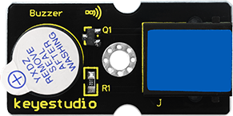
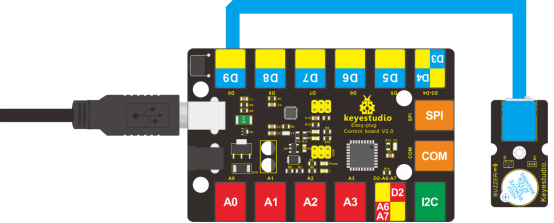

### Project 5 Make A Sound

**1.Introduction**

After many light-related lessons, let’s learn how to make a sound. Sound experiment is usually done with a buzzer or a speaker, while buzzer is simpler and easier to use. In this lesson, we will learn how to make a sound with an active buzzer.

**2.Components Needed**

- EASY plug Control board V2.0 *1
- EASY plug cable *1
- USB cable *1
- EASY plug Active Buzzer Module *1

Here is a brief introduction of EASY plug active buzzer module. 



EASY plug active buzzer module is the simplest sound-making module. It has an inner vibration source. Simply connect it with 5V power supply, it can buzz continuously. With Easy plug design, you can easily plug it into EASY plug controller board to have a try. Below are its specifications:  

- Working voltage: 3.3-5v
- Interface type: digital
- Size: 39*20mm
- Weight: 6g

**3.Connection Diagram**

Now, connect the module to the D9 port of the controller board using the EASY plug cable.



**4.Test Code**

Connect the board to your PC using the USB cable; copy below code into Arduino IDE, and click upload to upload it to your board.

```c
int buzzPin = 9; // Connect Buzzer to D9

void setup()
{
  pinMode(buzzPin, OUTPUT); // set I/O pin as “output” 
}

void loop()
{
  digitalWrite(buzzPin, HIGH);// set digital I/O output as “high”, the buzzer will sound
  delay(500);// wait for 0.5S
  digitalWrite(buzzPin, LOW);// set digital I/O output as “low”, the buzzer will stop making sound
  delay(500); // wait for 0.5S      
}
```

**5.Test Results**

The buzzer will ring for 0.5s and stop making sound for 0.5s.