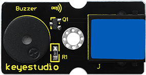
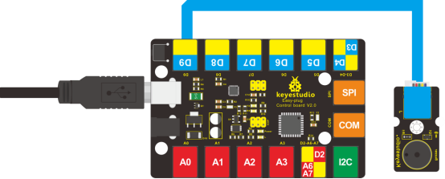

### Project 6 Who's Singing

**1.Introduction**

In the previous lesson, we have learned how to make a sound. In this lesson, we will use another type of buzzer to code the melody of a song. It’s called a passive buzzer. Using the codes we gave you, this lesson is also quite simple.

**2.Components Needed**

- EASY plug Control Board V2.0 *1
- EASY plug Cable *1
- USB Cable *1
- EASY plug Passive Buzzer Module *1

Let’s first learn a little bit about this EASY plug passive buzzer module. 



Different from active buzzer, passive buzzer is not set with a vibration source, so DC signal cannot make it buzz. A 2K~5K square wave is used to drive it. Different frequencies produce different sounds. So we can use Arduino to code the melody of a song. Below are its specifications:  

- Working voltage: 3.3-5v
- Interface type: digital
- Size: 39*20mm
- Weight: 6g

**3.Connection Diagram**

Now, connect the module to the D9 port of the controller board using the EASY plug cable.



**4.Test Code**

Connect the board to your PC using the USB cable; copy below code into Arduino IDE, and click upload to upload it to your board.

```c
#define D0 -1
#define D1 262
#define D2 293
#define D3 329
#define D4 349
#define D5 392
#define D6 440
#define D7 494

#define M1 523
#define M2 586
#define M3 658
#define M4 697
#define M5 783
#define M6 879
#define M7 987

#define H1 1045
#define H2 1171
#define H3 1316
#define H4 1393
#define H5 1563
#define H6 1755
#define H7 1971
// List all D tune frequency
#define WHOLE 1
#define HALF 0.5
#define QUARTER 0.25
#define EIGHTH 0.25
#define SIXTEENTH 0.625

// list all tempos
int tune[]=        // List each frequency according to numbered musical notation
{
  M3,M3,M4,M5,
  M5,M4,M3,M2,
  M1,M1,M2,M3,
  M3,M2,M2,
  M3,M3,M4,M5,
  M5,M4,M3,M2,
  M1,M1,M2,M3,
  M2,M1,M1,
  M2,M2,M3,M1,
  M2,M3,M4,M3,M1,
  M2,M3,M4,M3,M2,
  M1,M2,D5,D0,
  M3,M3,M4,M5,
  M5,M4,M3,M4,M2,
  M1,M1,M2,M3,
  M2,M1,M1
};

float durt[]=       // list all tempo according to numbered musical notation
{
  1,1,1,1,
  1,1,1,1,
  1,1,1,1,
  1+0.5,0.5,1+1,
  1,1,1,1,
  1,1,1,1,
  1,1,1,1,
  1+0.5,0.5,1+1,
  1,1,1,1,
  1,0.5,0.5,1,1,
  1,0.5,0.5,1,1,
  1,1,1,1,
  1,1,1,1,
  1,1,1,0.5,0.5,
  1,1,1,1,
  1+0.5,0.5,1+1,
};
int length;
int tonepin=9;   // set module signal pin to D9 

void setup()
{
  pinMode(tonepin,OUTPUT);
  length=sizeof(tune)/sizeof(tune[0]);   // calculate length
}

void loop()
{
  for(int x=0;x<length;x++)
  {
    tone(tonepin,tune[x]);
    delay(500*durt[x]);   // this is use to adjust tempo delay, you can change the number to your liking.
    noTone(tonepin);
  }
  delay(2000);
}
```

**5.Test Results**

The buzzer will play Ode to Joy, and then pause for 2S.