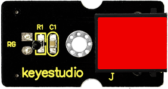
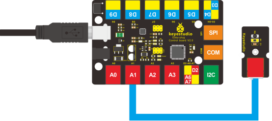
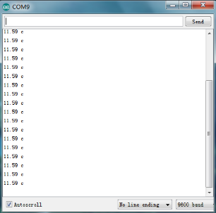
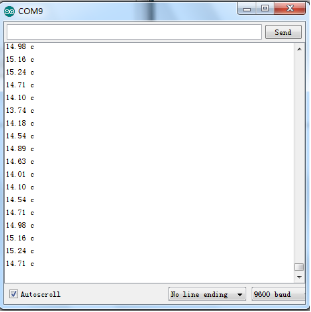
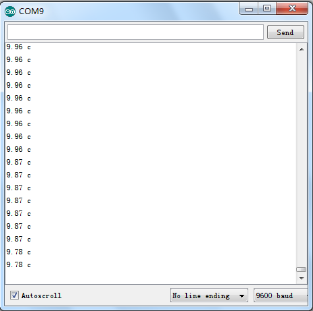

### Project 7 Temperature Measuring

**1.Introduction**

In this lesson, we will learn how to measure the temperature of our surroundings. You may feel hot or cold sometimes, but how can you know for sure? Well, let’s measure it. 

**2.Components Needed**

- EASY plug Control Board V2.0 *1
- EASY plug Cable *1
- USB Cable *1
- EASY plug Analog Temperature Sensor *1

First, let’s take a look at this EASY plug analog temperature sensor.



Analog temperature sensor is based on the working principle of a thermistor (resistance varies with temperature change in the environment). It can sense temperature change in its surroundings and send the data to the analog I/O in the controller board. Below are its specifications:  

- Interface type: analog
- Working voltage: 5V
- Temperature range: -55℃～315℃
- Size: 38*20mm
- Weight: 4g

**3.Connection Diagram**

Now, connect the module to the A1 port of the controller board using a EASY plug cable.



**5.Test Code**

Connect the board to your PC using the USB cable; copy below code into Arduino IDE, and click upload to upload it to your board.

```c
double Thermister(int RawADC) 
{
    double Temp;
    Temp = log(((10240000/RawADC) - 10000));
    Temp = 1 / (0.001129148 + (0.000234125 + (0.0000000876741 * Temp * Temp ))* Temp );
    Temp = Temp - 273.15; // Convert Kelvin to Celcius
    return Temp;
}

void setup()
{
	Serial.begin(9600);
} 

void loop() 
{
    Serial.print(Thermister(analogRead(1))); // display Fahrenheit 
    Serial.println(" c");
    delay(500);
}
```

**6.Test Results**

Pic 1 shows the temperature the sensor senses in serial monitor; pic 2 is when you blow air with your mouth to the sensor, the temperature goes higher; pic 3 is when you blow the sensor with a fan, the temperature drops. Now, you can know the exact temperature of your surroundings.





