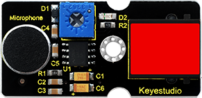
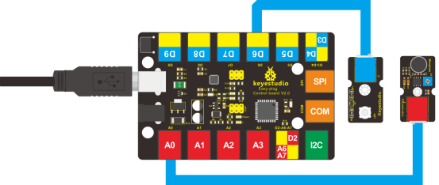

### Project 8 Make A Sound-controlled Lamp

**1.Introduction**

This is a simple, but interesting lesson. We will make a sound-controlled lamp. Usually, this test is done by clapping your hand. But due to many sound interference in the environment, we will blow air into the sound sensor instead.   

**2.Components Needed**

- EASY plug Control Board V2.0 *1
- EASY plug Cable *2
- USB Cable *1
- EASY plug Digital White LED Module *1
- EASY plug Analog Sound Sensor *1

First, let’s learn something about this EASY plug analog sound sensor.



Analog sound sensor is typically used in detecting the loudness in ambient environment. The sound sensor can pick up sound signal and convert it into voltage value. You can use it to make some interesting interactive works such as a voice operated switch or a sound-controlled lamp in this lesson. Below are its specifications:

- Supply Voltage: 3.3V to 5V
- Detecting sound intensity
- Interface: Analog
- Size: 38*20mm
- Weight: 5.5g

**3.Connection Diagram**

Now, connect the LED module to the D6 port of the controller board, and sound module to A0 using the EASY plug cables.



**4.Test Code**

Connect the board to your PC using the USB cable; copy below code into Arduino IDE, and click upload to upload it to your board.

```c
int ledpin=6;// set LED to D6
int soundpin=0;// set sensor to A0

void setup()
{
  Serial.begin(9600); // open serial port, set the baud rate at 9600 bps
  pinMode(ledpin,OUTPUT);// set LED pin as output
}

void loop()
{
  int val;
  val=analogRead(soundpin);   // read the value of sensor pin and assign it to val 
  Serial.println(val);
  if (val>170) 
  {            
    digitalWrite(ledpin, HIGH);  // turn LED ON
  } 
  else
  {
    digitalWrite(ledpin, LOW); // turn LED OFF
  }   
  delay(100);
}
```

**5.Test Results**

When you blow air into the sensor, the air vibrates; the sensor will pick up the sound signal and turn on LED.