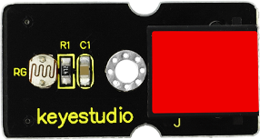
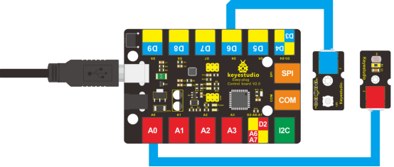

### Project 9 Make A Light-controlled Lamp 

**1.Introduction**

From the name of this lesson, you can find out this lesson is very similar to the previous one. In the last one, the LED is controlled by sound while in this one, the LED will be controlled by light. So here, we will use a light-related photocell sensor.  

**2.Components Needed**

- EASY plug Control Board V2.0 *1
- EASY plug Cable *2
- USB Cable *1
- EASY plug Digital White LED Module *1
- EASY plug Photocell Sensor *1

First, a brief introduction of this EASY plug Photocell Sensor.



Photocell is a semiconductor in nature. It features high sensitivity, quick response, spectral characteristic, and R-value consistence and maintains high stability and reliability even in extreme environments such as high temperature and extra humidity. It’s widely used in automatic control switch fields. Below are its specifications: 

- Interface type: analog
- Working voltage: 5V
- Size: 38*20mm
- Weight: 5g

**3.Connection Diagram**

Now, connect the LED module to the D6 port of the controller board, and photocell sensor to A0 port using the EASY plug cables.



**4.Test Code**

Connect the board to your PC using the USB cable; copy below code into Arduino IDE, and click upload to upload it to your board.

```c
int photopin=0;// set photocell sensor to A0
int ledpin=6;// set pin6 LED as PWM output to adjust the LED brightness
int val=0;// define variable val

void setup()
{
    pinMode(ledpin,OUTPUT);// set digital pin 11 as output
    Serial.begin(9600);// set baud rate to 9600
}

void loop()
{
    val=analogRead(photopin);// read the analog value of the sensor and assign it to val
    Serial.println(val);// display val value
    analogWrite(ledpin,val/4);// turn on LED and set to maximum brightness(PWM output is 255)
    delay(10);// wait 0.01S
}
```

**5.Test Results**

When you block light from the sensor, the LED becomes less bright; when you shine light on the sensor, the LED becomes brighter.